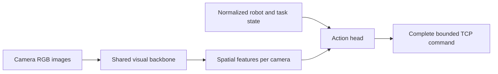

# Direct visual policy

Implemented 2026-09-17 from the
[June 17 architecture notes](https://github.com/yoonjung0705/tutorials/blob/master/python/libraries/tutorial_aic.md#617-2026-hybrid-train-branch-model-training-especially-for-isaac).
See the [model checks](experiments/2026-09-17-direct-visual-policy.md) for measured
results and [live validation](experiments/2026-09-17-live-validation.md) for
scored trials, videos, and the current reset/control/data blockers.

## Architecture



`actor_mode=direct_visual` is the offline CLI default. The same
[actor implementation](../aic_utils/lerobot_robot_aic/lerobot_robot_aic/direct_visual_actor.py)
loads in offline learning, Isaac, and Gazebo. Images directly affect the action
head. There is no ACT action proposal, residual addition, correction clip, or
ACT preservation objective. TCP delta pose remains the controller's command
format: “direct” means the model predicts that entire command.

| Setting | Behavior |
| --- | --- |
| `--actor-backbone resnet18` | ResNet18 initialized from scratch; optionally copy ACT visual weights with `--actor-backbone-checkpoint <pretrained_model>`. ACT's decoder/action head and normalizer are not copied. |
| `--actor-backbone resnet18_imagenet` | ImageNet initialization from torchvision. |
| `--actor-backbone dinov2_vits14` | Official pretrained DINOv2 ViT-S/14. Code is pinned to revision `7764ea0f912e53c92e82eb78a2a1631e92725fc8`; first use downloads code/weights into Torch's cache. |
| `--actor-backbone small_conv` | Small convolutional network for quick implementation checks. |
| Backbone training | Enabled by default. `--freeze-backbone` is an explicit ablation. ResNet uses fixed batch-normalization statistics for small batches; its convolutional weights train. |
| Spatial information | Each camera retains a 2×2 feature grid. The model uses a shared backbone and a fixed, recorded camera order. |
| Normalization | State/action statistics fit training episodes only. Image inputs are float RGB in `[0,1]`, resized and ImageNet-normalized inside the actor. Statistics are saved in checkpoint buffers. |
| Action limits | One positive physical limit per coordinate; defaults are 0.02 m for translation and 0.2 rad for rotation. Choose limits for the intended control rate/start distribution and save them with the model. |
| Action horizon | One step for RL. Offline transitions advance one frame, so multi-step action chunks are allowed only with `bc_only`. |

The current RL update is a deterministic actor-critic with twin Q networks and
optional BC. SAC entropy tuning, a TD3 target actor, and target-policy smoothing
remain possible algorithm changes. The current critics retain their existing
encoder options; DINOv2 support in this change is on the actor.

Legacy `act_adapter` and `act_direct` modes remain explicit for historical
checkpoints. The older Hydra experiments and stateful/axial recipes select these
legacy paths. Use the direct visual entry points below for new architecture work.

## Bounded offline run

Check `nvidia-smi` and choose an idle physical GPU. These examples use one GPU;
keep the total across concurrent work at **four GPUs or fewer**. Routine commands
use the existing user environment and require no sudo.

The existing dataset has label and split problems found by the
[demonstration audit](experiments/2026-09-17-live-validation.md#demonstration-audit).
The command below reproduces an implementation smoke; repair those problems
before using it for an architecture comparison.

From the repository root:

```bash
export AIC_GPU=0
export AIC_DIRECT_RUN="outputs/experiments/$(date -u +%Y%m%d_%H%M%S)_direct_visual_bc"
CUDA_VISIBLE_DEVICES="$AIC_GPU" OMP_NUM_THREADS=4 \
  .pixi/envs/default/bin/python aic_utils/lerobot_robot_aic/scripts/train_vision_offline_serl.py \
  --dataset-root outputs/hf_combined/clean_sfp_to_nic_sc_to_sc_task_conditioned_contact_features_h264 \
  --output-dir "$AIC_DIRECT_RUN" \
  --actor-mode direct_visual --actor-backbone resnet18 \
  --actor-backbone-checkpoint outputs/train/clean_sfp_sc/act/bc/20260510_clean_act_nact8_400k/checkpoints/175000/pretrained_model \
  --actor-update-mode bc_only --reward-mode zero --action-horizon 1 \
  --batch-size 4 --steps 40 --seed 17 --save-every 40 \
  --val-fraction 0.05 --val-every 20 --val-max-batches 2 \
  --max-wall-time-minutes 5
```

To use DINOv2, select `--actor-backbone dinov2_vits14` and omit the ACT backbone
checkpoint argument. ACT pretraining is optional. For Q-based offline learning,
first validate reward labels and select `q_bc` with the appropriate reward mode.
`final_success` assumes every episode ends successfully and is unsuitable for
unfiltered failed/incomplete demonstrations.

The smoke above evaluates only eight held-out frames per validation pass. It
checks the learning path. Use episode/scene-balanced evaluation across the full
held-out set before selecting a policy.

## Inspect the saved actor

```bash
CUDA_VISIBLE_DEVICES="$AIC_GPU" OMP_NUM_THREADS=4 \
  .pixi/envs/default/bin/python aic_utils/lerobot_robot_aic/scripts/evaluate_vision_offline_serl_actor.py \
  --dataset-root outputs/hf_combined/clean_sfp_to_nic_sc_to_sc_task_conditioned_contact_features_h264 \
  --checkpoint "$AIC_DIRECT_RUN/checkpoint_latest.pt" \
  --batch-size 8 --max-batches 4 --num-workers 0 \
  --output-json "$AIC_DIRECT_RUN/heldout_actor_check.json"
```

This evaluates imitation error, a zero-action baseline, and image sensitivity
on 32 held-out frames. It does not run simulation. Missing weights/schema keys
fail loading. A saved direct visual checkpoint includes the backbone, action
head, normalization, action limits, and architecture config. It needs no ACT
TorchScript or ACT normalizer at inference. DINOv2 also needs its pinned model
code in Torch's cache or network access on first load; include that dependency
when preparing a container.

## Isaac and Gazebo entry points

The Isaac launcher recognizes `direct_visual` checkpoints and selects one-step
execution with zero residual/preservation penalties. Preview the command first:

```bash
.pixi/envs/default/bin/python aic_utils/aic_isaac/scripts/train_isaac_online_serl.py \
  --checkpoint "$AIC_DIRECT_RUN/checkpoint_latest.pt" \
  --steps 20 --updates 0 --dry-run
```

This generates a plan only. A real run needs the [Isaac container setup](LOCAL_WORKFLOW.md#4-work-with-isaac-without-losing-artifacts),
an explicit episode/reset configuration, and recorded success geometry. Use
zero updates/exploration for evaluation. History and runtime clipping overrides
are rejected when they would change the saved direct actor contract.

For official Gazebo evaluation, follow the [dedicated-container workflow](LOCAL_WORKFLOW.md#3-test-act-through-the-gazebo-challenge-runtime),
changing the evaluator selection to:

```bash
--run-dir "$AIC_DIRECT_RUN" \
--checkpoint-glob 'checkpoint_latest.pt' \
--policy-module aic_example_policies.ros.RunDirectVisualSERL \
--n-action-steps 1 --command-mode delta_pose --command-frame gripper/tcp
```

These are arguments to `scripts/evaluate_act_checkpoints_runtime.py`, not a
standalone shell command; omit `--act-torchscript`. The runner uses the existing
`AIC_SERL_*` runtime settings and defaults to zero translation/rotation deadband,
so small insertion commands are preserved. The bridge transfer validator also
accepts `--policy-kind direct_visual` without an ACT export. Runtime commands
were exercised live: the direct actor completed one official Gazebo trial
without insertion, and Isaac loaded it for zero-action reset diagnostics. The
Isaac checks did not evaluate learned actions. See the [live report](experiments/2026-09-17-live-validation.md).

## Next comparisons

Live checks and the dataset audit are now complete, with blocking findings.
The following sequence remains gated on repairing those findings; see
[current priorities](STATUS.md#next-experiments-in-order).

1. **Validate resets, action direction, and the expert start fix.** The two
   CheatCode variants now preserve depth for aligned final-descent starts.
   Confirm behavior with inserted/near-port/uninserted resets before generating
   more demonstrations. Keep official success separate from the handoff gate.
2. **Audit demonstrations and split by scene.** Check success labels, failed
   endings, task balance, action magnitudes, and contact phases. Hold out board,
   port, and reset configurations; random adjacent-frame splits can leak scenes.
3. **Compare representations under one contract.** Test ACT-initialized ResNet,
   ImageNet ResNet, DINOv2, and scratch initialization with identical data,
   action limits, and evaluation. Measure latency/memory as well as success.
4. **Add contact memory deliberately.** Compare a short force/proprioception
   history or recurrent head, and finer image crops near the connector. These
   require new recorded observation schemas and matched runtime preprocessing.
5. **Choose one RL algorithm before scaling.** A TD3-style actor/critic update
   and DrQ-style image augmentation are reasonable controlled comparisons.
   Their papers support these as general methods; benefit on this task is an
   untested hypothesis. See [TD3](https://proceedings.mlr.press/v80/fujimoto18a.html)
   and [DrQ-v2](https://arxiv.org/abs/2107.09645).
