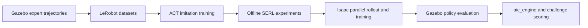

# Working on the hybrid training branch

Start here when returning to this repository. These pages describe the local
`feat/hybrid-train` work; the original toolkit guide remains in the
[repository README](../README.md).

| Question | Maintained page |
| --- | --- |
| What works, what is unresolved, and what should we do next? | [Current status](STATUS.md) |
| Where is the current ACT run? | [All-eligible, task-conditioned ACT](experiments/2026-09-18-act-all-verified.md) |
| Where are the previous ACT results and rollout videos? | [Earlier verified-data ACT experiment](experiments/2026-09-17-act-verified-8h.md) |
| What did the world-model pilot show? | [Dreamer pilot](experiments/2026-09-18-dreamer-pilot.md) and [paired follow-up](experiments/2026-09-18-world-followup.md) |
| Did world pretraining help the supervised policy? | [Matched initialization comparison](experiments/2026-09-18-world-supervised-init-ablation.md) |
| What did the world-model follow-up require, and what remains? | [World-model next steps](WORLD_MODEL_NEXT_STEPS.md) |
| How did the full verified-data world run perform? | [Full tokenizer, dynamics, and final evaluation](experiments/2026-09-19-full-world-training.md) |
| What happened in the Isaac transfer, guided policy head, and supervised pose-probe experiments? | [Isaac execution record](experiments/2026-09-20-isaac-world-policy-rl.md) |
| Why did we choose perception, supervised control, and then gated model-free RL? | [Perception-to-RL decision and result](experiments/2026-09-20-perception-supervised-rl.md) |
| How did causal temporal and multi-view perception handle cable occlusion? | [Design, papers, setting gaps, execution, and result](experiments/2026-09-21-temporal-multiview-perception-plan.md) |
| What happened with force-safe cable resets and natural guided cable trajectories? | [Cable reset, handoff audit, static/natural comparison, held-out-shape result, and frozen error-tail audit](experiments/2026-09-22-cable-visibility-perception.md) |
| Did frozen pose conditioning improve the supervised controller? | [Matched GRU architecture, training, autonomous rollouts, pose-reliance audit, and stop decision](experiments/2026-09-22-pose-conditioned-gru-policy.md) |
| Did forcing pose through an explicit correction path help? | [Balanced corrective collection, mandatory pose residual, counterfactual gate, and stop decision](experiments/2026-09-22-explicit-pose-correction.md) |
| What happened with port-relative RPDP BC and DPPO? | [Action/frame audit, four-waypoint labels, diffusion and direct BC, DAgger data, live results, and the selected 14/14 supervised controller](experiments/2026-09-22-rpdp-dppo.md) |
| How should online RL learn recovery from failures, and how do the two exploration strategies differ? | [SERL recovery strategy](SERL_RECOVERY_STRATEGY.md) |
| How should the deterministic BC transformer become a probabilistic SERL actor? | [Probabilistic trajectory actor](SERL_PROBABILISTIC_ACTOR.md) |
| What happened when that actor, critic warm-up, and backtracking were executed? | [Probabilistic SERL and measured-path recovery experiment](experiments/2026-09-22-serl-mixture-recovery.md) |
| Why did each recorded BC/RL/backtracking episode succeed or fail? | [Three-camera video and geometry failure analysis](experiments/2026-09-23-serl-video-failure-analysis.md) |
| How should we reproduce and learn recovery for multi-card SC-to-SC cable snags? | [Ordered SC cable-snag recovery plan](SC_CABLE_SNAG_RECOVERY_PLAN.md) |
| Where are the earlier simulator/control checks? | [Live validation report](experiments/2026-09-17-live-validation.md) |
| What did we try, and what evidence supports the result? | [Experiment ledger](EXPERIMENTS.md) |
| How do I use rootless Docker and test a saved policy locally? | [Local workflow](LOCAL_WORKFLOW.md) |
| Where are datasets, checkpoints, logs, and videos saved? | [Artifact map](../outputs_README.md) |
| Where are the EC2/S3 CheatCode and agent demonstrations? | [Dataset locations and provenance](DATASETS.md) |
| Where did the older plans, status notes, and reports go? | [Historical archive](../obsolete/README.md) |
| How does the new actor work, and how do I run it? | [Direct visual policy](DIRECT_VISUAL_POLICY.md) |

## How the pieces fit

The challenge runs cable insertion trials with different connectors, target
ports, board layouts, and starting poses. Much of the later local work narrows
this to SFP-to-NIC insertion near the port. A result on one such reset does not
establish performance across the challenge settings.

This diagram describes the historical experiment paths. The new
[direct visual actor](DIRECT_VISUAL_POLICY.md) learns from images/state without
requiring ACT actions; ACT visual-weight initialization is optional. See
[status](STATUS.md) before choosing a training recipe.

| Component | Role and starting point |
| --- | --- |
| Official Gazebo stack | `aic_bringup` launches the scene; `aic_controller` executes commands; `aic_adapter` assembles observations; `aic_engine` runs trials using the scoring stack. Start with [interfaces](aic_interfaces.md) and [scoring](scoring.md). |
| Policy boundary | `aic_model` loads a policy that answers the insertion action. Saved-policy runners live in `aic_example_policies/aic_example_policies/ros/`. See [policy integration](policy.md). |
| Data and offline learning | `aic_utils/lerobot_robot_aic` contains recording, dataset transforms, ACT wrappers, and SERL code. [Package guide](../aic_utils/lerobot_robot_aic/README.md). |
| Fast simulator | `aic_utils/aic_isaac` has separate Isaac assets, controller integration, resets, and Python reward/success logic. It does not run the official Gazebo scorer. [Setup and assets](../aic_utils/aic_isaac/README.md). |
| Gazebo RL bridge | `aic_utils/gazebo_rl` connects a Python learner to the asynchronous ROS/Gazebo stack over IPC. Useful for transfer checks; see the repaired score interpretation and remaining checks in [status](STATUS.md). |

Keep observation normalization, camera order, task encoding, action units/frame,
control frequency, and executed action horizon with each model. Sharing a 6D
action shape does not establish equivalent behavior between simulators.

## Documentation maintenance

Maintain the entry pages linked above. Update status when the next action or
evidence changes; add a ledger entry when an experiment ends, including failed
and inconclusive runs. Put detailed new records under `docs/experiments/` using
the [experiment template](experiments/TEMPLATE.md). A run that changes code or
evaluation criteria gets a new record/run ID.

Keep raw metrics, resolved configs, commands, model files, and videos in the run
directory. Commit the small explanation and durable artifact location to Git.
Record code revision **and local diff**, simulator/image identity, dataset and
checkpoint lineage, actual episode count, and exact success criteria. A path to
an ignored local file is a locator, not a backup.

Superseded reports, plans, and handoffs are under [obsolete/](../obsolete/README.md),
with their original directory structure and updated links. Their “current,”
“best,” and “next” statements refer to that report's
time and experiment. The [ledger](EXPERIMENTS.md) points to the relevant records;
the [September audit](experiments/2026-09-17-reentry-audit.md) explains historical
contradictions, with subsequent fixes in the
[repair record](experiments/2026-09-17-evaluation-curriculum-fixes.md).
Documentation is evidence and guidance, not proof that a script
is correct or that a saved model succeeds.
