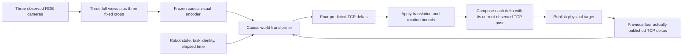

# Dreamer-style AIC pilot — September 18, 2026

Status: corrected TCP-delta training and all four development checks are complete. The policy/runtime were frozen at 20:11:11 UTC, and the paired twenty-scene final evaluation completed at 21:25:07 UTC. The final result is **0/20 insertions** after 1/4 development insertions; reliable insertion was not achieved. Approved budget: **15:52:56–22:42:56 UTC**, at most physical GPUs **2, 3, 4**. ACT's all-data experiment uses GPUs 0 and 1 separately. At 18:14 UTC, user steering confirmed that direct policy outputs must be observation-relative TCP/body deltas. Earlier absolute-command world/BC runs below are preserved as superseded representation baselines. This document is not a successful-control claim.

## Final reliability result

The frozen final evaluation completed at **21:25:07 UTC**. All **20/20 trials were eligible**, each using a fresh simulator, a valid precommand initial state, the correct task identity, ground truth disabled and the full 90 simulated seconds. The selected model and runtime remained unchanged throughout the final set.

| Measure | Final result |
|---|---:|
| Full insertions | **0/20** |
| Official partial insertions | 2/20, scenes 1 and 13 |
| Mean official total | **32.32** |
| Prohibited-contact penalties | 1/20, scene 8: penalty −24, total −23 |
| Applied insertion-force penalties | 0/20 |
| Actual ROS decisions | 8,908 |
| Observation-processing → publication latency | **p95 77.01 ms; p99 92.63 ms** |
| Maximum measured latency | 150.49 ms; no samples ≥200 ms |

The latency requirement passed on one A6000 for inference, with Gazebo rendering on a separate GPU. The timing includes preprocessing, transfer, worker IPC, model execution, output conversion and actual publication; sensor acquisition and ROS delivery before policy processing are excluded. **Reliable insertion was not achieved.** The development success below did not generalize to the final set. Neither a good offline command error nor passing latency establishes successful control.

The persistent final archive is `paired_world_archives/world_tcp_delta_final_worker_v1/` (426 hashed files, approximately 64.2 MB), including official scores, 1 fps videos, terminal images, low-dimensional rollout records, initial-state checks and command logs. `world_final_analysis/independent_final_audit.json` verifies all final outcomes and frozen source/model/device identities. The [terminal overview](../../outputs/experiments/2026-09-18_dreamer60_pilot/world_final_analysis/terminal_overview.png) shows all twenty recorded endpoints; the official scorer determines insertion outcomes. The owned simulator container was stopped after evaluation.

## Frozen development result

The selected step 4000 supervised policy completed all four fresh development scenes with valid initial states, task identities and 90 simulated seconds each. Official totals were **49.49,36.25,86.46,36.36**, mean **52.14**, with **1/4 insertions**. The successful third scene had Tier3=75, no prohibited contact penalty, and no applied force penalty; its force log recorded28.01 N for 0.02s, below the 1s penalty-duration threshold. Terminal images and the official score agree with insertion.

Across 1,782 actual ROS decisions, observation processing through command publication measured **p95 81.00 ms, p99 95.48 ms**, maximum 133.11 ms. Every measured decision was under 150 ms. The inference worker uses one A6000 (physicalGPU3); simulator rendering usesGPU2. The isolated benchmark alone had failed to predict live latency before this runtime fix.

`world_final_selection_tcp_delta_worker.json` freezes the selected model, worker, normalization, action contract, CUDA mapping, initial-state gate and comparator reference. Its SHA256 is `4d080321a0eb43f4a48a09c0ad155f67edf03035a2f418b232d4446b60d7d336`. Twenty final scenes began at 20:11:11; ACT's separately frozen comparator began at 20:11:42 onGPU4. No model or runtime tuning uses these final scenes. The development media/audits are archived under `paired_world_archives/world_tcp_delta_development_worker_v1/`; all 54 frozen runtime/source records are under `world_tcp_delta_final_runtime_archive/`.

## Reproduce and locate artifacts

- Source: sibling checkout `../dreamer-v4-aic-20260918`, branch `aic-pilot-20260918`, derived from upstream `1163696c628cf53ff230487b7244206cbe3fe909`.
- Persistent experiment: `outputs/experiments/2026-09-18_dreamer60_pilot/`.
- Bulk checkpoints, arrays, logs and rollouts: `/var/tmp/chmin_aic_20260918_dreamer60/`; linked by the experiment's `artifacts` symlink. NVMe is working storage, not the only intended copy of the selected result.
- Exact commands, commits and hashes: `budget.json`, `initial_source_snapshot.json`, `tokenizer_refine_v1_launch.json`, per-stage `options.json` and `complete.json`.
- Python: this AIC checkout's `.pixi/envs/default/bin/python`. Run model modules from the sibling Dreamer checkout.
- Rootless simulator: the frozen evaluation uses `aic_dreamer60_eval_gpu23_20260918`, with rendering on physical GPU 2 and policy inference on physical GPU 3 (`cuda:1`), ROS domain 124. The earlier GPU 2-only container is preserved and stopped. See the workspace's `ROOTLESS_DOCKER_GUIDE.MD`; no sudo is required. Each scored trial gets a fresh simulator, 90 simulated seconds and a 180-second wall watchdog, with ground truth disabled.

## Fixed comparison data

The primary comparison uses exactly **60 training / 14 validation episodes**, all aligned SFP insertion with one NIC card, no SC distractor and SFP card 0 / port 1. There are 73 unique physical scene configurations: training episodes 130 and 149 duplicate a scene; no training/validation scene overlap was found.

There are 32,183 native observations (26,207 training / 5,976 validation). The earlier absolute-command ACT cache causally resampled these to 41,575 rows. The corrected ACT and world-policy datasets both use the exact 32,183 native observations and byte-identical teacher TCP-delta labels. Episode membership is unchanged; the original absolute-representation split SHA256 was `f551fcc1ac0704710108f6ba3b6eeffe74b022c3a306da6eae29be5731be7200`.

Teacher targets and actual executed commands are separate. Twelve training episodes and one validation episode contain student interventions. Their streams differ in 1,760 training and 148 validation observations. Dynamics receives actual execution; supervised policy targets remain teacher commands. Missing command intervals are excluded; images and timestamps are never invented to complete a sequence.

A decision represents four 6D TCP/body delta commands issued at 20 Hz, covering 200 ms. Each is relative to the observation used for that micro-command. The runtime composes the observed TCP pose with the predicted delta at the physical command API boundary. The bounded action transform is fitted only on training commands, includes physical margin, round-trips without clipping and contains every held-out command. Inputs are three RGB cameras, 32 robot-state values with controller-error entries masked, the canonical 10D task vector, and elapsed time.

The corrected immutable data directory is `artifacts/data_tcp_delta/`, split SHA256 `fd4fb418f500a9f5f80782d830d0e976a90e70cd8584822b2b2af89ec9f55409`. Raw `action` is the teacher TCP delta: composing it with its recorded observation reconstructs `teacher_target_pose` within 3.4e-8 meters/radians across all 74 episodes. Actual dynamics inputs are separately derived from the recorded observation and `executed_target_pose`. The aligned collector published physical targets in `base_link`; those targets are converted back into the matching observed TCP delta for dynamics, without substituting teacher commands during student interventions.

## Model and implementation

The selected six-view model has **27,130,942 total parameters**, with **22,569,344 acting parameters** after removing the decoder and unused heads. Acting FP32 weights occupy approximately 90.3 MB. It uses a shared causal image tokenizer, a 384-wide / 12-layer action-conditioned world transformer, and a policy that directly predicts TCP deltas. It does not use an ACT residual adapter. The corrected world context is two macro frames; the unchanged visual tokenizer retains its eight-frame context.

The acting parameter breakdown is 3,294,368 in the visual encoder, 18,941,952 in the world transformer, and 333,024 in the policy heads (`selected_model_size.json`). The transformer holds about84% of acting weights, so reducing its depth is the clearest future size ablation; the final model is unchanged.

This is a smaller Dreamer-style adaptation, not a reproduction of the paper's training result. Explicit changes include 144-pixel letterboxed images, short contexts supported by the recordings, SDPA without attention logit softcapping, gradient reconstruction loss instead of LPIPS, and fixed training-set physical-state scaling. The original FlexAttention GPU backward path failed an assertion in this environment; SDPA smoke tests and cache checks passed.

Acting encodes real observations and uses observed history. It does not generate imagined images before producing a command. Actual bounded commands accepted by the publication callback become the next decision's action history. Failed publication raises an error. The dedicated runtime and evaluator preserve task identity, initial-state, duration, source-hash and ground-truth-off checks; shared ACT runtime/evaluator files are unchanged.



The ROS process handles images, state and publication. A private inference worker holds the encoder, transformer and causal caches; its outputs are byte-identical to the checked in-process implementation. The diagram describes acting, where no imagined video or reward model is used.

### What was optimized

1. **Tokenizer:** reconstruct recorded RGB views with pixel MSE, image-gradient loss, and the separately recorded contact-region refinement. The visual encoder was then frozen.
2. **Dynamics:** predict visual and physical-state tokens using shortcut/flow training, conditioned on the actual executed four-command sequence. Missing native command edges are excluded.
3. **Supervised policy:** optimize masked teacher-command Huber loss plus `0.005 ×` squashed-Gaussian negative log likelihood, with `0.1 ×` the dynamics auxiliary loss. World-transformer and policy parameters train; the visual encoder stays frozen. Unobserved future command slots contribute no BC loss. Acting uses the deterministic squashed policy output.
4. **Reward / imagination:** not trained. Authoritative positive observed states were absent, and held-out dynamics failed its fidelity gate.

These loss weights and masking rules are implemented in the pinned `dreamer4/aic/objectives.py`; every run's `options.json` records its optimizer, batch size and initialization.

## Completed stages and gates

| Stage | Evidence | Outcome |
|---|---|---|
| CPU contracts | `reward_gate_final_tests.log` | 16 tests passed, including action round trips, task masking, cached inference, generated state evolution, export reload and reward-head freezing. |
| GPU forward/backward | `gpu_sdpa_smoke.json` | All three trainable stages had finite gradients; cached/full inference agreed in the tested case. |
| Untrained latency preflight | `untrained_latency.json` | On one A6000: p95 28.49 ms, p99 29.15 ms over 1,000 timed calls. Includes image preprocessing, transfer, model and pose conversion; excludes capture/ROS. The later trained and live ROS measurements are reported above. |
| Main tokenizer | `tokenizer_main_v1/complete.json` | 5,981 updates in 3,000.59 seconds; stopped at its 50-minute phase cap, not demonstrated saturation. Best held-out pixel MSE checkpoint: step 5,500. |
| Main tokenizer detail check | `tokenizer_inspect_main_final/` | Scene geometry is recognizable, but native connector/PCB detail remains blurred. Pixel MSE does not establish control readiness. |
| Separate detail refinement | `tokenizer_refine_v1/` | Started from the preserved main best checkpoint. Lower image masking, stronger edge/contact-region losses, and occasional single native frames. Completed all 2,500 updates in 901.57 seconds; best checkpoint at 2,500. Fine contact detail remains blurred. |
| Insertion-event timing | `insertion_events/` | All 74 episodes have a narrowly timestamped correct-port event after their final native observation (40–142 ms in training, 46–124 ms in validation). These remain successful command trajectories; their last saved images are not verified inserted-state observations. |

Long valid windows underrepresent the exact final native image: 8-frame windows reach it in only 12/60 training and 2/14 validation episodes; 2-frame transitions reach it in 50/60 and 11/14. Single-image tokenizer samples cover all episodes. The main tokenizer stage is preserved separately from the refinement addressing this coverage issue. ACT sampling was not changed.

The selected tokenizer was **not demonstrated to be fully converged**. The
main run ended because of its 50-minute cap while validation was still making
new bests. Both the full-view refinement and six-view crop adaptation completed
their planned 2,500 updates, but each selected its final checkpoint, which is
evidence that more optimization could still help rather than evidence of a
plateau. Later 1,000-update 74-versus-expanded-data runs were deliberately
bounded comparisons and also selected their final checkpoints. More training
alone is not guaranteed to recover contact detail: all variants remained
visibly blurred and the 224-pixel interpolation ablation was worse, but the
existing stopping records do not support calling the tokenizer saturated.

**Reward gate:** episode end is only a collection boundary. The immutable initial data manifest's proposed last-frame reward is an obsolete proxy, not authoritative insertion supervision. The implemented trainer freezes reward and continuation heads and refuses imagination training without verified labels. No reward head has been trained from that proxy. The completed event audit found zero synchronized post-event RGB/state examples, so the strict74 imagination-reward gate failed. A later raw-bag audit found controller-state tails in all 74 bags (0.134–0.922 seconds), but no image/video topics in any bag; these state-only tails are not synchronized RGB reward examples. Imagination RL is excluded from this pilot. World pretraining followed by supervised policy learning remains valid independently of that gate.

## Earlier absolute ACT60 comparator (superseded)

The comparator is newly initialized from ImageNet ResNet18, with no inherited ACT policy weights, and trained on the same 60/14 split. It completed 6,000 updates in 2,129 seconds. A fixed validation rule selected step 6,000: first-command translation error 5.531 mm, final-three-second error 4.807 mm, rotation error 0.645 degrees. Different offline samplers must not be treated as directly comparable metrics.

Four frozen development scenes completed with valid initial state, identity and 90-second simulation duration. ACT60 achieved **0/4 insertions**, mean official score **30.80** (34.65, 31.33, 31.94, 25.28). This is a weak baseline, not a reliable policy. Selection/checkpoint/media archives are under `act60_selected_archive/`.

The shared scene manifest pins four development and twenty final scenes, disjoint from every expert scene. Its SHA256 is `28a1a5dc0a2d6e311daa885260439e4e553edd9b799c68a3687a2393c74b93e0`. Final scenes were sealed until the model and runtime freeze at 20:11:11 UTC. Parent ACT evaluation and Dreamer evaluation use separate GPU/domain containers.

## Corrected training

The absolute-command dynamics run stopped cleanly after 6,344 updates / 1,497.87 seconds, retaining step 1500 under its fixed validation rule. Its initial BC run then stopped cleanly after 245 updates /93.72 seconds when the user clarified the action representation. `external_stop_reason.json` records these actual reasons; the trainer's generic `deadline_or_phase_cap` string does not establish convergence or a time-budget stop.

Corrected dynamics started at **18:28:41 UTC** on GPUs 2/3 from freshly initialized world/policy weights, retaining only the image tokenizer. Exact encoder weights/configuration and GPU outputs were checked; the visual outputs are bit-identical. Training uses global batch512, primarily two-frame transitions, occasional four-frame sequences, and a cap of5,000 updates or25 minutes. See `world_tcp_delta_v1_launch.json`; source commit `0bb9493`. Twenty-seven model/data CPU tests, eleven dedicated evaluator tests, real-data GPU gradients, and a complete inherited ROS delta-loop composition/history test passed.

Missing native observations cannot supply observation-relative deltas at intermediate times. Corrected dynamics therefore uses4,942 training /924 validation strict200 ms edges, covering all 60/14 episodes. Three-frame windows cover44/9 episodes and four-frame windows21/5; eight-frame validation windows do not exist. This short and uneven transition coverage limits what this pilot can establish about longer-horizon world modeling; preserving successful BC labels does not create missing dynamics observations. Longer-horizon checks report these denominators explicitly. Corrected BC retains all observed first teacher commands and masks19,747 training /4,657 validation unknown future-command slots. It never repeats a delta label across a missing observation.

Corrected dynamics stopped cleanly at **18:45:56 UTC**, after **3,191 updates / 1,030.44 seconds**, because validation worsened and the retained best failed the fidelity gates. This was an explicit bounded early stop, not convergence or the 25-minute cap. The fixed selection rule retains **step 1,000** (conditional validation TCP error12.48 mm). Its separate generated-rollout audit gives:

| Horizon | Validation episodes | Actual commands: TCP error | Shuffled commands | Persistence |
|---|---:|---:|---:|---:|
| 200 ms | 14 | 10.33 mm | 11.65 mm | 1.85 mm |
| 400 ms | 9 | 14.80 mm | 17.91 mm | 4.47 mm |
| 600 ms | 5 | 19.56 mm | 21.54 mm | 9.03 mm |

All three numerical gates fail. The final-three-second observed-recording proxy gives10.77/17.98/19.29 mm, versus persistence0.08/0.15/0.51 mm, across 13/2/1 episodes respectively. This sparse proxy is not a verified physical-contact annotation. Shuffled actions are complete verified four-command sequences from another held-out episode; all source indices are preserved. The decoded predictions still blur the connector and port. Reports and terminal sheets are in `world_tcp_delta_after2500_best/`; the final frozen selection repeats the same audit.

The exact zero-command BC baseline is **17.066 mm ordinary / 5.894 mm terminal**, using the fixed corrected-policy validation sampler; the equal-weight selection metric is11.480 mm. See `tcp_delta_zero_command_baseline.json`. Offline ACT metrics use a different sampler and should not be directly compared.

Corrected supervised BC began at **18:46:27 UTC** on GPUs 2/3, global batch 512, with an 8,000-update / 55-minute cap. The trained export passed a CPU-only ROS constructor and inherited eight-command loop test without CUDA or a simulator. The completed training and selected checkpoint are described below. Imagination was excluded throughout.

On the selected checkpoint, a CPU sensitivity check measured 1.823 mm ordinary command error, increasing to 6.435 mm when visual latents came from another validation episode at the nearest elapsed time, and 16.169 mm with zeroed visual features. Shuffling actual executed history gave 2.405 mm. These are corrupted-input diagnostics, not counterfactual accuracy or proof of a pretraining benefit. The visual shuffle's elapsed-time gap was 0.85 seconds median / 2.73 seconds at the 95th percentile, so scene geometry and visual phase are not separated. See `tcp_delta_selected_policy_sensitivity.json`.

### Selected corrected policy and runtime check

BC stopped cleanly at **19:20:03 UTC**, after **4,509 updates / 2,012.54 seconds**. A practical early-stop rule was added during the run at 19:12:33, anchored at step 3,000: stop after three later500-update checks without1% improvement. It is a compute stopping rule, not a convergence proof or part of the original checkpoint-selection rule. The original fixed equal-weight ordinary/terminal metric selects **step 4,000**, with **1.822 mm ordinary /2.508 mm terminal** translation-command error; all 14 terminal observations are included.

The selected control export has22,569,344 acting parameters. Its initial benchmark on training-sized images measured p95 28.22 ms/p99 30.13 ms. The first simulator attempt then found an integration error before any command: the dedicated runtime required256×288 images, while the simulator sends1024×1152. The attempt and its score1 are preserved as an incomplete startup failure. The corrected dedicated runtime now performs the same area resize as the expert collector before full/crop preprocessing; model weights and shared ACT sources did not change.

Ten CPU camera tests cover exact resize equality, RGB/BGR/RGBA/BGRA, both image sizes and padded rows. The repeated1,000-call trained benchmark through the real raw-image parser, bounds and observed-pose/ROS-message conversion measured **p95 32.765 ms /p99 33.886 ms**, maximum 36.943 ms, with no calls over 200 ms. It uses a mocked accepted publication callback; the final freeze additionally requires actual publication-callback p95<300 ms across all four complete simulator development scenes. See `camera_resize_correction/` and `tcp_delta_trained_raw_camera_latency.json`.

The selected full checkpoint, control export, selected dynamics checkpoint, resumable last BC checkpoint, data/selection/stopping records and source bundle are archived persistently in `world_tcp_delta_selected_archive/` with per-file hashes. The original runnable paths remain under NVMe. The initial failed development attempt is `artifacts/world_tcp_delta_development_v1/`; the resize-corrected and thread-limited diagnostic attempts are `artifacts/world_tcp_delta_development_resize_v1/` and `artifacts/world_tcp_delta_development_threads_v1/`. Both were stopped after actual ROS publication latency failed the p95<300 ms gate; neither is an eligible completed control trial.

### Live latency debugging

The isolated raw-camera benchmark was insufficient to establish real ROS latency. With rendering and inference sharing physicalGPU2, the resize-corrected attempt measured p95 **479.51 ms** across 168 commands; a separately preserved OpenCV/Torch/BLAS thread-limit retry measured p95 **713.02 ms** across 196 commands. Both attempts stopped before a complete90 sim trial and remain diagnostic failures. `live_latency_failed_attempts.json` pins their raw policy logs and every measured command.

A subsequent controlled test kept the selected step 4,000 weights unchanged and separated Gazebo rendering on physicalGPU2 from policy inference on physicalGPU3. `dreamer_device_layout.json`, the container profile, CUDA UUID mapping, and a new runtime freeze record the placement. A single original development scene first measured actual observation parsing through publication with rendering active; it cannot satisfy the required four-scene final-selection gate. GPU separation alone failed the live gate (p95 464.85 ms). A concurrent separate-process benchmark onGPU3 stayed at 33.65 ms p95 while the same scene rendered onGPU2, supporting process-local ROS callback contention. That diagnostic reached90 sim but also retained an initial-state provenance mismatch: the helper used the older pre-delta source contract, although measured arm error0.0279rad was within the unchanged0.05rad threshold. The following attempts used the corrected, already-reviewed TCP-delta source contract.

The dedicated inference worker keeps the same causal controller, model weights and actual-command history in a child process; ROS observation handling, physical bounds and publication stay in the policy process. Four verified native observations produced byte-identical commands, task reset reproduced the first command, and error/timeout/EOF/cleanup checks passed. The worker source, tests, device mapping and latency reports are archived in `inference_worker_retry/`. The trained raw-camera benchmark including IPC remains below45 ms p95; the completed one-scene gate reached90 sim seconds in111.66 wall seconds, with 1,787 commands (19.86 Hz),447 decisions, p95 76.12 ms/p99 86.78 ms and zero calls over 200 ms. Initial state and task identity passed; insertion failed with official score36.42. The completed fresh four-scene development batch is `artifacts/world_tcp_delta_development_worker_v1/`; its final freeze and metrics are summarized above.

The [live latency distribution](../../outputs/experiments/2026-09-18_dreamer60_pilot/world_live_latency_diagnostics.png) compares these preserved attempts with the four completed worker scenes. The sample counts and durations differ; it describes runtime measurements, not a controlled model-quality comparison.

### Supplemental crops from recorded camera images

The selected six-view variant retains the three full camera images and adds three fixed RGB contact crops from the stored288×256 observation grid through the same tokenizer. The crop is fixed in that grid’s image coordinates (64, 96, 224, 240); it receives no privileged geometry. Simulator sensor images are1152×1024 and are first resized with the expert collector’s `cv2.INTER_AREA` operation. These are higher-resolution crops relative to the 144-pixel full views, not native sensor-resolution features. A visual coverage audit reviewed every terminal image in all 74 episodes and early/middle images in all 14 validation episodes. The terminal frontplate/tool area is retained; some early center views clip the target, so crops are strictly supplementary. Coverage evidence and exact image-array SHA are in `native_crop_coverage_review.json`. The original tokenizer reconstructed these new crops poorly; a separately recorded 2,500-update crop adaptation was completed before caching the selected features. The selected learned six-view policy passed the complete worker and live ROS latency gates described above.

### Original BC boundary audit (absolute prototype; superseded masks)

The teacher command attached to the last observed state remains valid even though there is no later image. BC now uses an independent per-command validity mask, including partial four-command chunks; dynamics still requires verified native transitions. This preserves the first teacher command for every one of the 26,207 training and 5,976 validation observations, including all 60/14 final observations. It masks 670 training and 153 validation unknown future-command slots and never fabricates commands after recording ends. See `bc_label_coverage.json`. Occasional single-observation BC updates make the terminal states reachable even when they cannot end a valid two-frame transition. Reward and continuation tensors are omitted from this unlabeled dataset; collection-end flags are metadata only. Twenty-three CPU tests cover these contracts, including zero gradient contribution from masked future labels.

### Tokenizer decision and supervised stages

The separate six-view crop adaptation completed all 2,500 updates in 909.76 seconds, selecting its final checkpoint. Full model: 27,130,942 parameters; acting: 22,569,344 parameters. Fine connector detail remains blurred, so **the fine-contact reconstruction gate did not pass**. The frozen feature probe also did not show a linear visual advantage: best reported state/time fit 2.83 mm versus 3.34 mm with frozen visual features on its own fixed held-out sample. Every ridge setting is retained; this is not a closed-loop result or proof that the representation contains no useful vision.

The recorded decision was to continue as a supervised diagnostic: freeze the six-view tokenizer, measure action-conditioned dynamics against persistence/shuffled commands, train teacher-command BC, then score actual simulator rollouts. No successful-world-model, deployment-readiness or imagination claim follows from this decision. `tokenizer_selection.json` records the failed gate, selected checkpoint/hash and approved diagnostic scope. The fresh ACT60 comparison and final20 scenes remain fixed.

The six-view policy-head preflight (still untrained) measured p95 31.31 ms and p99 34.10 ms over 300 calls after 100 warmups on one A6000; the later trained, complete runtime measurement is reported above. Before BC training, checkpoint selection was fixed to the equal-weight mean of ordinary held-out first-command position error and final-observation first-command error across all 14 validation episodes, using each final state’s available actual causal history. The corrected TCP-delta rule is `tcp_delta_policy_selection_rule.json`; the original `policy_selection_rule.json` remains historical.

### Earlier absolute dynamics diagnostic (superseded representation)

The actual dynamics run started at 17:46:48 UTC on GPUs 2 and 3, with global batch 128 and 8-frame / occasional 16-frame windows plus short 2-frame transitions. It ran at approximately 0.238 seconds per update, using 14.7 GB peak allocated memory per rank. Source, cache and tokenizer fingerprints are pinned in `world_native_detail_v1_launch.json`.

An early step-500 evaluation found one / four / eight-step TCP errors of **7.64 / 10.74 / 19.40 mm**, versus **2.30 / 9.79 / 17.25 mm** for persistence. Its original shuffled control gave **10.41 / 19.53 / 32.80 mm**, but repeated one other-episode command across the four-command chunk. That diagnostic is preserved as superseded: a corrected comparison now uses all four commands of a verified transition from another episode and records their source indices. Training/model/runtime behavior was unchanged.

In that original report, the final-three-second recording proxy gives actual versus repeated-command control errors of **6.50 / 7.22 / 8.35 mm** versus **11.61 / 21.75 / 37.82 mm**, while persistence gives **0.20 / 0.41 / 0.63 mm**. Only three validation episodes support this late eight-step horizon. This proxy precedes insertion; it is not a verified physical-contact annotation. Decoded predictions retain gross geometry and blur fine connector detail. `world_fidelity_early/report.json` preserves the original episode-balanced and phase-specific results; `world_fidelity_step500_macro_shuffle/report.json` is the corrected control, followed by a later-checkpoint check before choosing the BC initialization.

The corrected step-500 shuffled control gives **10.43 / 19.56 / 32.74 mm** overall and **11.62 / 21.71 / 37.74 mm** in the final-three-second proxy. Actual-action and persistence results are identical to the original run. Recorded shuffle sources were checked against verified native transitions; all numerical fidelity gates still fail. See `shuffled_control_correction.json`.

## Running the selected policy locally

For a trained control export and latency report, `freeze_world_policy.py` writes a manifest pinning the model, normalizers, runtime sources and scene set. `run_paired_world.py` verifies that manifest, then runs one fresh simulator for each scene. The dedicated policy uses `RunDreamerV4`; it inherits the tested command loop and requires observation-relative TCP deltas, four commands per decision, and the six-view checkpoint contract.

```bash
# From this AIC checkout; substitute the completed selection path.
.pixi/envs/default/bin/python \
  outputs/experiments/2026-09-18_dreamer60_pilot/run_paired_world.py \
  --split development \
  --selection outputs/experiments/2026-09-18_dreamer60_pilot/world_development_selection_tcp_delta_worker.json \
  --output-dir /var/tmp/chmin_aic_20260918_dreamer60/world_development_local_check
```

The command above performs discovery and source/scene checks. Add `--run` to execute. Use a fresh output directory; preserved attempts are never overwritten. This historical pilot runner pins its owned GPU 2+3 container and explicit device mapping and September18 deadline, so future experiments should copy it under a new experiment and explicitly update the budget, scene manifest and runtime freeze. Each result includes official scores, initial-state and duration audits, three-camera1fps videos, terminal sheets and observation-to-command latency samples. A complete development result is required before the separate final-selection helper permits the final split.

## Interpretation and follow-up experiments

The corrected pilot tests a supervised policy initialized from world pretraining. It does not test imagination RL: the reward-positive observation gate and the numerical dynamics gates failed. A better simulator score would establish a useful control result for this pipeline, not accurate learned physics or a causal benefit from pretraining. A separate [matched initialization comparison](2026-09-18-world-supervised-init-ablation.md) has now completed training, the offline audit and four new development scenes per arm. Both arms had zero full insertions; the world-initialized arm had lower offline command error and one partial insertion. It does not change this frozen pilot result.

Preserved final rollouts show a useful failure pattern: little sampled terminal TCP motion despite substantial ongoing commands. In scene 15's last ten simulated seconds, periodically logged bounded translation commands had median norm 38.06 mm, recorded controller translation error was 40.09 mm, and wrist-force norm was 9.43 N. Scene 12 showed a similar gap. These observations rule out zero commands as the explanation for these particular sampled stalls; they do not identify whether contact, alignment or controller response caused them. Controller error is recorded for diagnosis but masked from policy inputs. `world_final_analysis/` preserves the read-only command/state audit; approximately 1 Hz snapshots cannot bound motion between frames. A focused contact/controller investigation on these preserved failures should precede another broad training sweep.

Future data collection should record every applied command together with its reference TCP observation, independently of image-saving cadence; missing camera observations must remain explicit. It should continue recording RGB/state/action timestamps after insertion and through explicit failures, with authoritative event labels. That would support reward calibration and termination checks without treating episode end as success. Dynamics should then be compared with persistence in narrow insertion phases, with enough independent scenes for each horizon. Higher-resolution observed contact features and direct state-change prediction are reasonable follow-ups; each needs a new held-out fidelity check and latency measurement.

The strict pilot covers one target configuration only. Its four-command visual replanning cadence differs from the corrected ACT comparator's single-command cadence. The paired simulator scenes support a pipeline comparison, not an architecture-only causal ranking or a claim about multi-card/SC generalization.

## Additional fidelity and raw-bag audit

The completed follow-up evaluates every strict held-out 200/400/600 ms window (924/158/54 windows from 14/9/5 episodes), compares true-latent decoding against predicted futures, and records temporal/motion bins plus position and angular errors. Persistence remains better overall. The raw-bag audit separately establishes that all 74 bags retain short controller-state tails after insertion events, while none records camera/video topics. See [completed evidence and remaining work](../WORLD_MODEL_NEXT_STEPS.md#selected-dynamics-future-latent-and-pose-audit). No model, policy, label or final-scene selection was changed.
