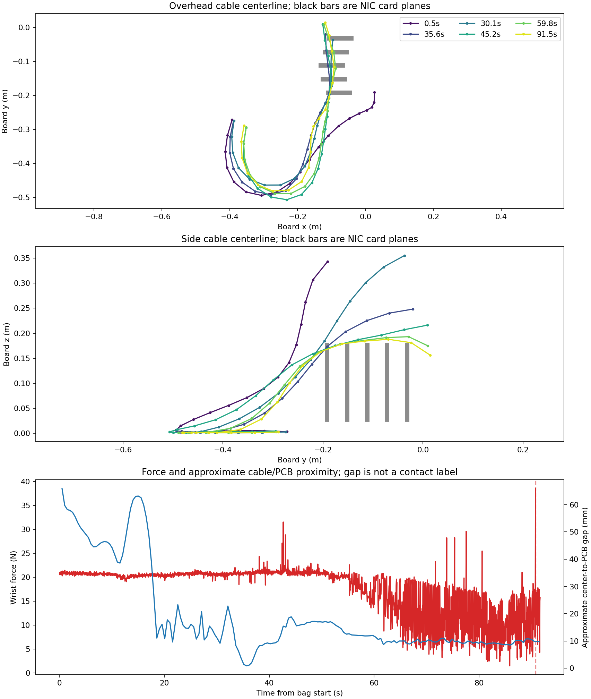
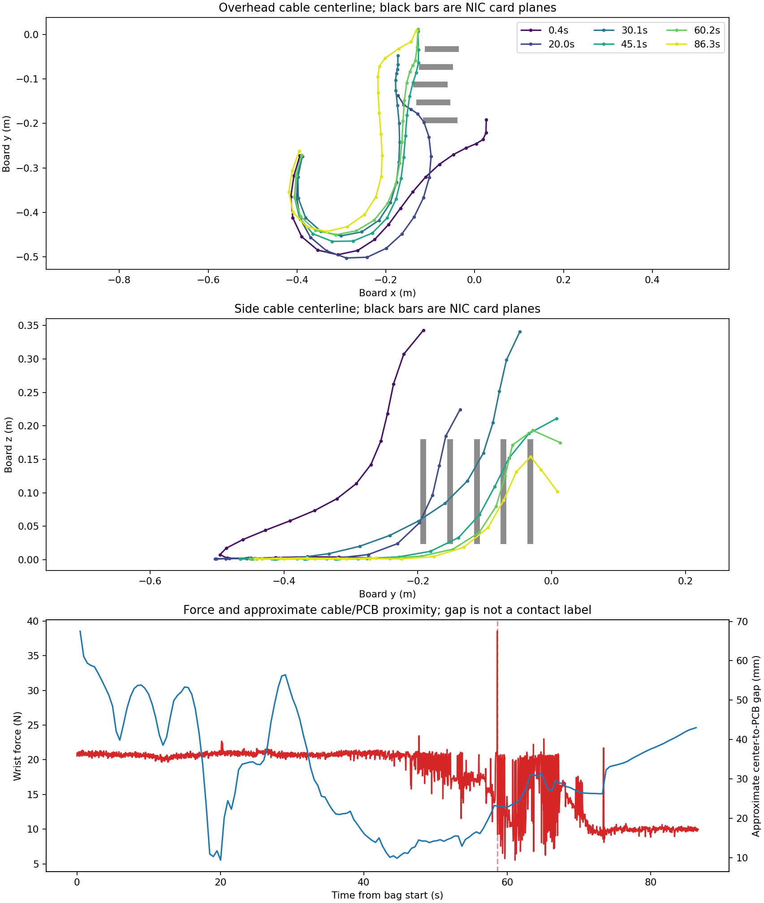

# Fixed five-card cable-route probe

Date: 2026-09-23

## Question and prior evidence

Could the older reported SC-to-SC cable catch have been caused by the
VLM/MoveIt transport route rather than stock CheatCode? The
[earlier audit](2026-09-23-ordinary-development-cable-audit.md) ran stock
CheatCode over 19 development scenes, replayed a saved low-score three-card
agent route, and ran stock CheatCode on a regenerated five-card seed. It did
**not** deliberately drive the cable across the five-card row. The historical
[outside-left template](../expert_matrix_template_fixes.md#sc-to-sc-nic-bypass-full-insertion-template)
reports a cable catch on an earlier seed-51500 run, but the failed raw
trajectory and video are absent from the checked archives.

The official [qualification description](https://github.com/intrinsic-dev/aic/blob/main/docs/qualification_phase.md)
says that the robot holds the SC plug and the cable's opposite SFP-module end
is free and unconnected. A free end does not prevent the middle of the cable
from draping over or catching on a card as the robot pulls the held end.

## S3 check

The collection still has an S3 prefix:

```text
s3://aic-team-sprinkle/datasets/clean/sc_to_sc/agent/sc_ports_1/n100__sc_ports1_nic5_n100/
```

The exact prefix contains the **accepted dataset** and accepted agent metadata.
Its `selection_report.csv` identifies attempts 27 and 28 as the accepted
episodes; neither is the old failed seed-51500 recording. I downloaded its
center-camera MP4 from S3. Its SHA-256 is
`9fb99750d4d5fc3c7fdf3a9342520eab2d972db2aad2c68cfb4f5efa17583430`,
identical to the local accepted video at
`outputs/trajectory_datasets/clean_including_no_insert_trajs/sc_to_sc/agent/sc_ports_1/n100__sc_ports1_nic5_n100/accepted_dataset/videos/observation.images.center_camera/chunk-000/file-000.mp4`.
The download is at
`/var/tmp/chmin_aic_s3_nic5_review_20260923/accepted_center.mp4`.

We also inventoried the bucket's `datasets/dev/` and `ec2_transfer/` prefixes,
and inspected the exact clean collection's `agent_generation/` prefix.
None contained a failed replay/video for seed 51500 or the old five-card
collection. This is a bounded search of those prefixes, not a claim about
every possible private backup.

## Controlled Gazebo test

We held one generated one-SC-port, five-NIC-card scene fixed: the first scene
from the retained request seed `51500`. Each run used the same saved
`eval_config.yaml`, normal collisions, the pinned official Gazebo image,
rootless Docker, and GPU 1. No model was trained. The diagnostic policy used
simulator TF to plan waypoints; it is **not a deployable policy**. After the
waypoints it handed off to the installed stock CheatCode for insertion. The
current generator and these hand-written routes do not recreate the missing
historical VLM/MoveIt trajectory; only the new runs are matched to each other.

All normal-height routes lifted, returned behind the first card, lowered the
TCP to about $z=0.207$ m in `base_link`, traversed the five-card row, lifted,
then approached the selected SC port. The routes differed in only the lane:

| Route | TCP lane in `base_link` | Intent |
| --- | ---: | --- |
| Across cards | $x=-0.4776$ m | Pass along the card row, giving the trailing cable a chance to drape on the cards. |
| Outside-left | $x=-0.5686$ m | Travel around the outside of the row before returning to the port. |

The separate low-clearance probe lowered the across-card pass by another
15 mm. It tested a possible stronger contact, but became a robot-clearance
failure and is excluded from the normal-height route comparison.

The installed three wrist cameras provide left, center, and right views. For
an additional angle, we reconstructed the *measured* positions of all 20
cable links and all five NIC cards from the scoring bag's `/scoring/tf` topic.
The saved plots show overhead and side views, synchronized with wrist force.
This geometry is used only for diagnosis. The autonomous actor has no access
to it. The plotted gray card bars approximate the main PCB collision planes;
the scalar gap is from a cable **segment center** to a main PCB box. It omits
cable radius, other card features, and named physics contacts.

## Outcomes

The official tier-3 message is the insertion outcome. This is a small,
fixed-scene diagnostic, not an estimated population success rate.

| Route and run | Outcome | Tier-3 score | Smallest cable-center to main-PCB gap | Cable link 5 motion, 60–80 s | Terminal plug axial / lateral | Terminal TCP command error |
| --- | --- | ---: | ---: | ---: | ---: | ---: |
| Stock CheatCode control | partial | 39.7 | 5.3 mm | episode ended before 80 s | +2.2 / 0.39 mm | 70.4 mm |
| Across 1 | **none** | 18.7 | **0.9 mm** | **0.3 mm** | **−46.7 / 0.82 mm** | **119.7 mm** |
| Across 2 | full | 75.0 | 8.6 mm | 29.8 mm | +15.6 / 0.39 mm | 58.0 mm |
| Across 3 | partial | 39.7 | 8.6 mm | 12.0 mm | +2.2 / 0.53 mm | 70.2 mm |
| Outside-left 1 | partial | 40.4 | 9.4 mm | 69.3 mm | +3.2 / 0.66 mm | 69.3 mm |
| Outside-left 2 | partial | 46.0 | 11.0 mm | 40.4 mm | +10.5 / 0.54 mm | 62.8 mm |
| Outside-left 3 | full | 75.0 | 7.6 mm | 33.4 mm | +15.6 / 0.01 mm | 57.3 mm |
| Across, 15 mm lower | none | 0 | 39.1 mm | 12.0 mm | −131.2 / 244.9 mm | 328.2 mm |

Axial and lateral distances use the measured plug tip relative to the selected
port opening; positive axial means the tip has crossed the entrance frame.
They are not the scorer's remaining-insertion distance. The route runs lasted
about 67 s of task time. All seven diagnostic runs completed their route,
passed model validation, had scoring bags, and had zero Gazebo
`physics entity ptr` errors. The old two diagnostic attempts that crashed due
to an API mismatch were kept only in the bulk root and excluded from this
table because the robot never executed the route.

### What the one across-row failure shows

At 35.65 s in Across 1, cable link 5's center came within 0.9 mm of the first
main PCB collider. The simulated cable collision radius is 2 mm in
`aic_assets/models/sfp_sc_cable_reversed/model.sdf`, so this sampled geometry
is compatible with cable/card contact. The wrist force then was about 20.8 N,
near the run's early baseline; the largest measured wrist-force spike,
38.5 N, came much later at 90.8 s. The scorer separately reported a 57.9 N
insertion-force maximum over 1.27 s. These are different measurements; the
force spike must not be retroactively labeled as the first cable contact.

The overhead and side plots show that link 5 settled near the first two card
tops. It moved only 0.3 mm from 60 to 80 s. During the later approach, the
measured TCP moved 16 mm from 60 to 80 s, then only 3.4 mm from 80 s to the
end while its command kept advancing. The plug stopped 46.7 mm before the
port entrance despite only 0.82 mm lateral error. This is a **credible
route-induced cable-trap candidate**. Across 2 followed the same planned
waypoints but kept at least 8.6 mm center-to-PCB clearance, moved link 5
29.8 mm over 60–80 s, and inserted fully. Across 3 also kept 8.6 mm
clearance and partially inserted. The difference appears in the cable's
realized motion, not in the nominal waypoint list.

The recorded scorer contact topic only labels *off-limit* contacts and does
not name cable-to-NIC-card contact. The camera views are attached to the
wrist and obscure some cable/card interfaces. We therefore cannot prove that
the card held the cable rather than another mechanical interaction, or call
this a verified causal snag suitable for RL labels. The lower route stopped
far behind the port with the cable about 39 mm from the main PCBs, illustrating
why a failed long route alone is not a cable-snag label.





The compact [machine summary](../../artifacts/prod_cheatcode_audit/ordinary_broad_followup/cable_route_probe/summary.json)
contains every run, score, measured error, plot, and video path. Start with
the [failed across-card video](../../artifacts/prod_cheatcode_audit/ordinary_broad_followup/cable_route_probe/across_1/visuals/all_cameras_1hz.mp4),
the [successful across-card repeat](../../artifacts/prod_cheatcode_audit/ordinary_broad_followup/cable_route_probe/across_2/visuals/all_cameras_1hz.mp4),
and the [outside-left partial](../../artifacts/prod_cheatcode_audit/ordinary_broad_followup/cable_route_probe/outside_1/visuals/all_cameras_1hz.mp4).
These review MP4s use H.264/AVC Constrained Baseline, 8-bit YUV 4:2:0,
and fast-start metadata for Ubuntu and browser playback. Images are sampled
once per second; the encoder repeats them at 10 fps, so playback time still
matches the recorded timeline. The codec-only conversion did not rerun the
simulator or alter the scored outcomes.

## Smoother replay with an actual full-scene cable view

We reran the **same saved `eval_config.yaml` and across-card route** with two
collision-free, static diagnostic cameras added to the pinned Gazebo world.
They do not supply actor observations: the policy was still the privileged
diagnostic waypoint route followed by stock CheatCode. The overhead camera
looks down on the whole board, cable loop, and gray free-end plug; the side
camera shows the cable height over the five cards. The original three wrist
cameras were captured alongside them. All five sources supplied actual
images every 0.05 s of simulation time, rather than repeated one-Hz frames.
The four synchronized H.264 videos play at 20 fps. Their roughly 63-second
video duration is simulation time; Gazebo took longer in wall time to render
the extra cameras.

One pilot lost its opening frames when the new recorder hit a ROS property
name collision. We fixed the recorder and excluded that pilot from the
full-coverage count. The following seven runs cover the entire scored task:

| Repeat | Official tier-3 outcome | Score | Review |
| --- | --- | ---: | --- |
| 02 | Partial insertion | 39.67 | [Combined comparison video](../../artifacts/prod_cheatcode_audit/ordinary_broad_followup/cable_route_probe/smooth_wide_repeat_02/visuals/all_views_20fps.mp4) |
| 03 | Partial insertion | 39.66 | Bulk frames and bag retained |
| 04 | Partial insertion | 39.67 | Bulk frames and bag retained |
| 05 | Partial insertion | 40.41 | Bulk frames and bag retained |
| **06** | **No insertion; scorer says 0.05 m remaining** | **19.72** | [Combined failure video](../../artifacts/prod_cheatcode_audit/ordinary_broad_followup/cable_route_probe/smooth_wide_repeat_06/visuals/all_views_20fps.mp4) |
| 07 | Partial insertion | 39.67 | Bulk frames and bag retained |
| 08 | Partial insertion | 39.67 | Bulk frames and bag retained |

For a larger image, open the failed run's [full-resolution overhead view](../../artifacts/prod_cheatcode_audit/ordinary_broad_followup/cable_route_probe/smooth_wide_repeat_06/visuals/overhead_20fps.mp4)
and [full-resolution side view](../../artifacts/prod_cheatcode_audit/ordinary_broad_followup/cable_route_probe/smooth_wide_repeat_06/visuals/side_20fps.mp4).
The [wrist-only triptych](../../artifacts/prod_cheatcode_audit/ordinary_broad_followup/cable_route_probe/smooth_wide_repeat_06/visuals/wrist_triptych_20fps.mp4)
uses the same clock. The [overhead contact sheet](../../artifacts/prod_cheatcode_audit/ordinary_broad_followup/cable_route_probe/smooth_wide_repeat_06/visuals/overhead_20fps_contact_sheet.jpg)
marks five points in that video. The gray plug at the end of the large yellow
loop in the overhead view is the **free, unconnected cable end**.

In repeat 06, the cable is visibly stretched across card tops while the
robot approaches the selected port. Around **48 seconds of video time**, the
wrist force peaks at 52.9 N; after that, the plug and measured TCP make
little forward progress while the TCP target keeps advancing. The plug ends
38.7 mm behind the port entrance, 4.45 mm laterally off center, with a
111.6 mm TCP command error and no insertion event. By comparison, partial
repeat 02 ends 2.2 mm *past* the entrance with 1.23 mm lateral error and a
27.6 N peak wrist force. These are measured outcomes from the bags; video
time was mapped from capture wall timestamps to the bag's wall timestamps.

The new failed repeat is **not evidence of the same specific snag** as the
older Across 1 run. In repeat 06, cable link 5 moved 19.1 mm from 60 to
80 s of bag wall time, whereas it moved only 0.3 mm in the older candidate.
Its closest sampled segment center was 1.36 mm from a main PCB collider, but
the bag still has no named cable/card contact. The larger 4.45 mm terminal
lateral error also makes a blocked or misaligned port approach plausible.
The footage shows the cable route and free end clearly; it does not isolate
which contact caused the stop. The complete [machine summary](../../artifacts/prod_cheatcode_audit/ordinary_broad_followup/cable_route_probe/smooth_wide_summary.json)
retains all repeat outcomes, source roots, rates, timestamps, and measured
geometry. Full JPEG frames and MCAP bags are at
`/var/tmp/chmin_aic_cable_route_smooth_20260923/`.

To reproduce a smooth-view run on one GPU, prepare a new audit directory with
the saved scene config and generated camera-only world/bridge, then run:

```bash
python artifacts/prod_cheatcode_audit/make_wide_audit_world.py \
  aic_description/world/aic.sdf aic_bringup/config/ros_gz_bridge_config.yaml \
  /var/tmp/my_smooth_audit
cp artifacts/prod_cheatcode_audit/ordinary_broad_followup/cable_route_probe/across_1/eval_config.yaml \
  /var/tmp/my_smooth_audit/eval_config.yaml
AIC_AUDIT_SMOOTH_CAPTURE=1 AIC_AUDIT_DEADLINE_SEC=1800 \
  bash artifacts/prod_cheatcode_audit/run_cable_route_diagnostic.sh \
  /var/tmp/my_smooth_audit across_cards
bag=$(find /var/tmp/my_smooth_audit/results -maxdepth 1 -type d -name 'bag_trial_*' | head -1)
.pixi/envs/default/bin/python artifacts/prod_cheatcode_audit/render_smooth_wide.py \
  /var/tmp/my_smooth_audit "$bag" /var/tmp/my_smooth_audit/visuals
```

## Reproduction and next gate

The route code, runner, geometry analysis, and packager are
`CableRouteDiagnostic.py`, `run_cable_route_diagnostic.sh`,
`analyze_cable_route_bag.py`, and `package_cable_route_diagnostic.py` under
`artifacts/prod_cheatcode_audit/`. The bulk MCAPs, captured frames, engine
and policy logs are in `/var/tmp/chmin_aic_cable_route_probe_20260923/`.
For one repeat, make a new directory, copy the compact scene YAML, and run:

```bash
mkdir -p /var/tmp/chmin_aic_cable_route_probe_20260923/new_across
cp artifacts/prod_cheatcode_audit/ordinary_broad_followup/cable_route_probe/across_1/eval_config.yaml \
  /var/tmp/chmin_aic_cable_route_probe_20260923/new_across/eval_config.yaml
bash artifacts/prod_cheatcode_audit/run_cable_route_diagnostic.sh \
  /var/tmp/chmin_aic_cable_route_probe_20260923/new_across across_cards
```

To turn this candidate into a causal cable-snag incident, collect a named
cable/card contact or equivalent constraint/tension measurement synchronized
with the segment poses, wrist force, commands, and measured plug/TCP motion.
Then replay the paired route with sufficient repetitions and validate that
removing only the cable/card interaction removes the stall while the robot
path and grasp remain unchanged. Keep the candidate and the lower-route
robot-clearance failure separate. Do not add this candidate to cable-specific
RL replay until its contact mechanism is identified.
