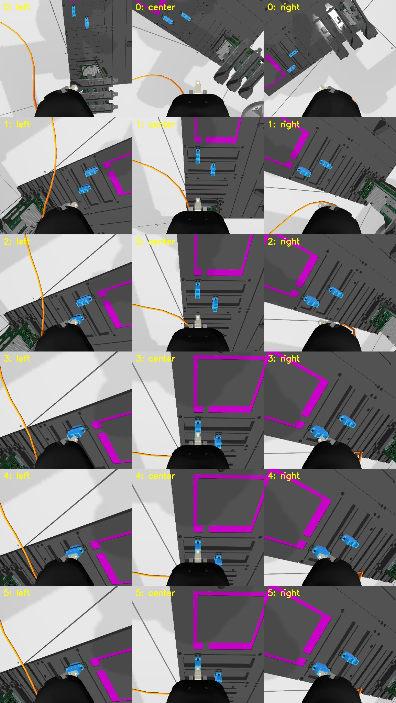
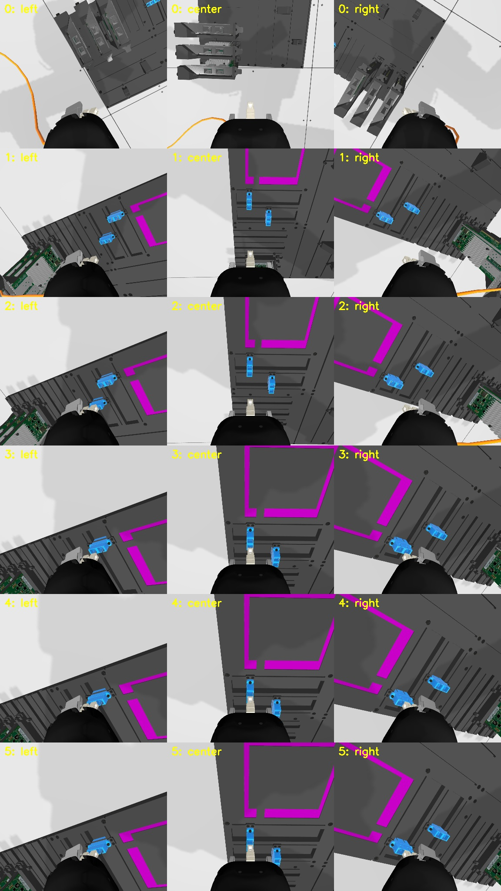
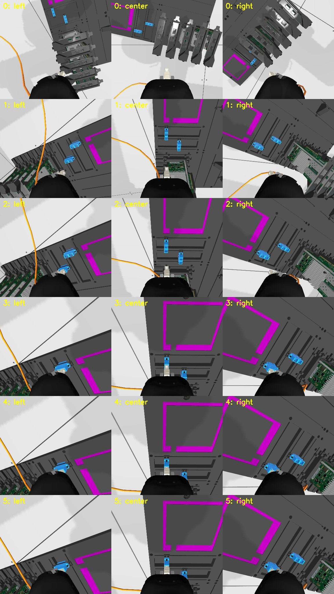

# Official Gazebo CheatCode failure audit

Date: 2026-09-23  
Status: exact replay and bounded production-family stress complete

## Correction to the earlier failure list

The earlier failure taxonomy was not produced entirely by running the released
production evaluation. It mixed three kinds of evidence:

1. failures observed in local Gazebo or Isaac development scenes;
2. failure mechanisms inferred from collision geometry and policy code;
3. plausible robotics failures that had not yet been reproduced.

That list was useful for brainstorming, but it was too broad to call a list of
production failures. In particular, the prior 185 SC and 52 SFP CheatCode
recordings used targeted data-collection scenes, not the exact released cloud
configuration. They are not evidence of failure frequency in production.

## What the organizers actually released

Intrinsic released the exact qualification `eval_config.yaml` in upstream PR
[#558](https://github.com/intrinsic-dev/aic/pull/558). The
[qualification documentation](https://github.com/intrinsic-dev/aic/blob/main/docs/qualification_phase.md)
states that this is the configuration used on the cloud evaluation platform.
The qualification results announcement on
[Open Robotics Discourse](https://discourse.openrobotics.org/t/aic-qualification-phase-results-advancing-teams/55138)
also points participants to that release.

The released file contains three fixed trials:

| Trial | Task | Board and obstacle layout | Target |
| --- | --- | --- | --- |
| 1 | SFP plug to NIC SFP port | One NIC card on rail 2 | Card 2, port 0 |
| 2 | SFP plug to NIC SFP port | Adjacent NIC cards on rails 3 and 4 | Card 4, port 1 |
| 3 | SC plug to SC port, reversed cable | NIC cards on rails 0, 1, and 2; both SC ports present | SC port 1 |

The robot home joints are fixed in this YAML. “Different initial positions” in
the qualification description refers to board/component/grasp variation. It
does not authorize changing the robot home pose and calling it an exact replay.

The current upstream repository also has `phase_1` and `phase_2` development
branches, but neither publishes another `eval_config.yaml`. Therefore this
record uses **production evaluation** to mean the released qualification cloud
configuration. A later physical-phase configuration must be audited separately
if it is released.

## Exact replay method

The replay used rootless Docker, one idle GPU, the cached official evaluation
image, the released YAML without scene edits, and the stock installed
`aic_example_policies.ros.CheatCode`.

```text
official repository commit: 749f385
eval_config.yaml SHA-256:
  9f987c07174481474eec2c4fa21faf7d84dae4743a037b809ed7945efb2e5ef5
installed CheatCode.py SHA-256:
  f118a2fe82cb074bfa8780d702ea3fa56f0c9de99953fd228b24264e21f19b3c
official image digest:
  sha256:9aa2ffdbb946d38edde1bac7b5f02a44cfbea26e3b04a9c74e09f14c97472923
```

Each trial retained the official scoring MCAP, engine and policy logs, and
one frame per second from all three wrist cameras. Five unchanged evaluation
runs produced 15 trials.

## Exact replay result

| Task | Full insertions | Partial | No insertion |
| --- | ---: | ---: | ---: |
| SFP to NIC, trials 1 and 2 | 10 / 10 | 0 | 0 |
| SC to SC, trial 3 | 4 / 5 | 1 / 5 | 0 |
| Overall | 14 / 15 | 1 / 15 | 0 |

This sample is too small for a precise population failure rate. It establishes
that the three-card SC trial can succeed and can also fail with the same policy
and YAML. That agrees with upstream issue
[#396](https://github.com/intrinsic-dev/aic/issues/396), which reports that
CheatCode “sometimes” fails evaluation case 3 but does not diagnose why.

Two historical toolkit problems should not be confused with current policy
failures. The organizers reported and fixed stale nested collision meshes and
retuned cable friction/inertia in April; see the
[Gazebo fix announcement](https://discourse.openrobotics.org/t/note-to-participants-gazebo-bug-fix-changes-to-friction-properties-of-the-cable/54098).
Participants also reported an intermittent between-trial reset problem where
an old command could move the robot before the next cable spawned; see the
[reset discussion](https://discourse.openrobotics.org/t/reset-issues-robot-moves-after-homing-before-cable-is-spawned/54515).
The present audit uses the post-fix official image. It still checks initial
spawn and motion evidence for every trial instead of assuming all failures are
caused by the policy.

### Reproduced SC failure



Run 3, trial 3 scored 57.81. The scorer classified it as a partial insertion
with about 10 mm remaining distance. The engine printed “All Tasks Completed”
because CheatCode returned `True`; there was no insertion event. Stock
CheatCode always returns `True` after its descent and five-second wait, so the
engine lifecycle result must not be used as the insertion label.

The scoring transforms localize this failure:

| Measurement at the terminal state | Value |
| --- | ---: |
| Lateral plug-to-port offset | about 0.06 mm |
| Relative orientation error | 0.19 degrees |
| Plug distance outside the entrance along the port axis | 3.21 mm |
| Plug distance from the port's final link target | 12.43 mm |
| Insertion events | 0 |

The plug was laterally and rotationally aligned, entered the opening partly,
then stopped in the axial direction. The command continued deeper, while the
measured TCP stopped. No off-limit contact penalty occurred. The corresponding
successful run reached 0.38 mm from the final port-link target and emitted the
insertion event.

The three camera views show the cable remaining away from the card faces during
the final approach. Together with the transform trace, this supports **local
SC port-mouth blocking** for this rollout. It does not support a cable snag or
gripper-card collision. The exact microscopic collider or latch contact is not
recorded by the official scoring topics, so that narrower cause remains open.

## Evidence status of proposed failure scenarios

| Scenario | Exact released production evidence so far |
| --- | --- |
| Misaligned or locally blocked insertion | **Observed**, more precisely a near-aligned axial SC block in 1/5 exact SC runs. |
| Cable snagged around NIC cards | **Not observed** in the five exact replays or bounded 0/1/3/5-card stress trials. |
| Gripper housing hits a card | **Not directly observed** in the exact or bounded Gazebo runs. Earlier causal evidence came from a mismatched Isaac scene. One board-pose cross-combination had a large tracking error, but its scoring data cannot name the blocking collider. |
| Excessive force | **Not scored** in the reproduced exact failure; successful and failed force norms were similar. |
| SFP failure in either released layout | **Not observed** in 10 exact SFP trials. |
| Policy reports completion without insertion | **Observed** in the partial SC run; this is a CheatCode termination bug/limitation. |

## Production-family stress suite

The exact YAML has fixed scenes, so it cannot answer how card count and allowed
component variation change failures. A second suite is explicitly labeled
**production-family stress**, not exact leaderboard replay. It changes one
documented factor at a time where practical while keeping the official robot,
cable types, targets, rail limits, task timing, and grasp convention.

It contains four SFP-to-NIC trials and nine SC-to-SC trials. SC coverage includes
0, 1, 3, and 5 NIC cards, both target SC rails, a rail-limit translation,
the other two released board poses, and the documented ±2 mm / ±0.04 rad grasp
deviation. Its exact manifest is saved with the artifacts.

### Stress results

| Variation | Result |
| --- | --- |
| SFP Trial 1 anchor, one card | Full insertion |
| SFP Trial 1 geometry, five cards | Full insertion |
| SFP Trial 2 anchor, two cards | Full insertion |
| SFP Trial 2 geometry, five cards | Full insertion |
| SC with 0 / 1 / 3 / 5 cards | Full insertion in all four trials |
| SC target changed from rail 1 to rail 0 | Full insertion |
| SC rail 1 moved to the released positive translation limit | Full insertion |
| SC task at the released Trial 2 board pose | Full insertion |
| SC task at the released Trial 1 board pose | No full insertion; about 20 mm remained |

The Trial 1 board-pose cross-combination ended with 8.05 mm lateral error,
0.18 degrees orientation error, and the plug 2.09 mm outside the entrance
axially. The TCP remained 72.6 mm from the requested target and wrist-force
norm peaked at 38.2 N. This is a workspace/contact tracking failure before fine
insertion, not the near-aligned port-mouth block seen in the exact SC failure.
The camera views do not show a cable wrap around a card. The scoring topics do
not identify the specific blocking collider, so the evidence does not
distinguish an arm/workspace limit from gripper, board, or card contact.



The first combined-axis grasp test was excluded from the production-family
count. Applying 2 mm and 0.04 rad independently on all three axes produced
norms of 3.46 mm and 0.069 rad, beyond the documentation's approximate total
deviation. It remains archived as an out-of-bound diagnostic.

A corrected five-card grasp suite used translation norm 2 mm and rotation norm
0.04 rad, one axis at a time:

| Grasp perturbation | Result |
| --- | --- |
| +2 mm x, +0.04 rad roll | Full insertion |
| -2 mm y, -0.04 rad pitch | Partial insertion |
| +2 mm z, +0.04 rad yaw | Full insertion |

The partial grasp trial was another local axial block. Its terminal lateral
offset was 0.023 mm and orientation error was 0.087 degrees. The plug passed
the entrance but remained 5.15 mm from the final target, with no insertion
event. The force trace was similar to the successful trials. This shows that
the direction of a small grasp error can matter even when privileged feedback
has nearly eliminated lateral and orientation error.



Across these bounded trials, increasing card count by itself did not produce a
cable snag. The observed failures were (1) an approach/workspace tracking
failure under a cross-combined board pose, and (2) intermittent or grasp-
sensitive axial SC port blocking. This does not prove cable snags cannot occur;
it means they should not be called a current production failure until a rollout
actually records one.

## Artifacts

- Exact machine summary: `artifacts/prod_cheatcode_audit/official_qualification/summary.json`
- Exact YAML and policy snapshot: `artifacts/prod_cheatcode_audit/official_qualification/`
- Reproduced failure metrics: `artifacts/prod_cheatcode_audit/official_qualification/runs/run_03/trial_3_analysis.json`
- Reproduced failure videos and contact sheet: `artifacts/prod_cheatcode_audit/official_qualification/runs/run_03/trial_3_visual/`
- Stress manifest and configuration: `artifacts/prod_cheatcode_audit/production_family/`
- Norm-bounded grasp summary: `artifacts/prod_cheatcode_audit/production_family_grasp_limit/summary.json`

The MCAP bags and per-second raw frames are bulk evidence and should remain
outside Git history. The compact summaries, manifests, selected images, and
short videos are suitable for the experiment archive.
