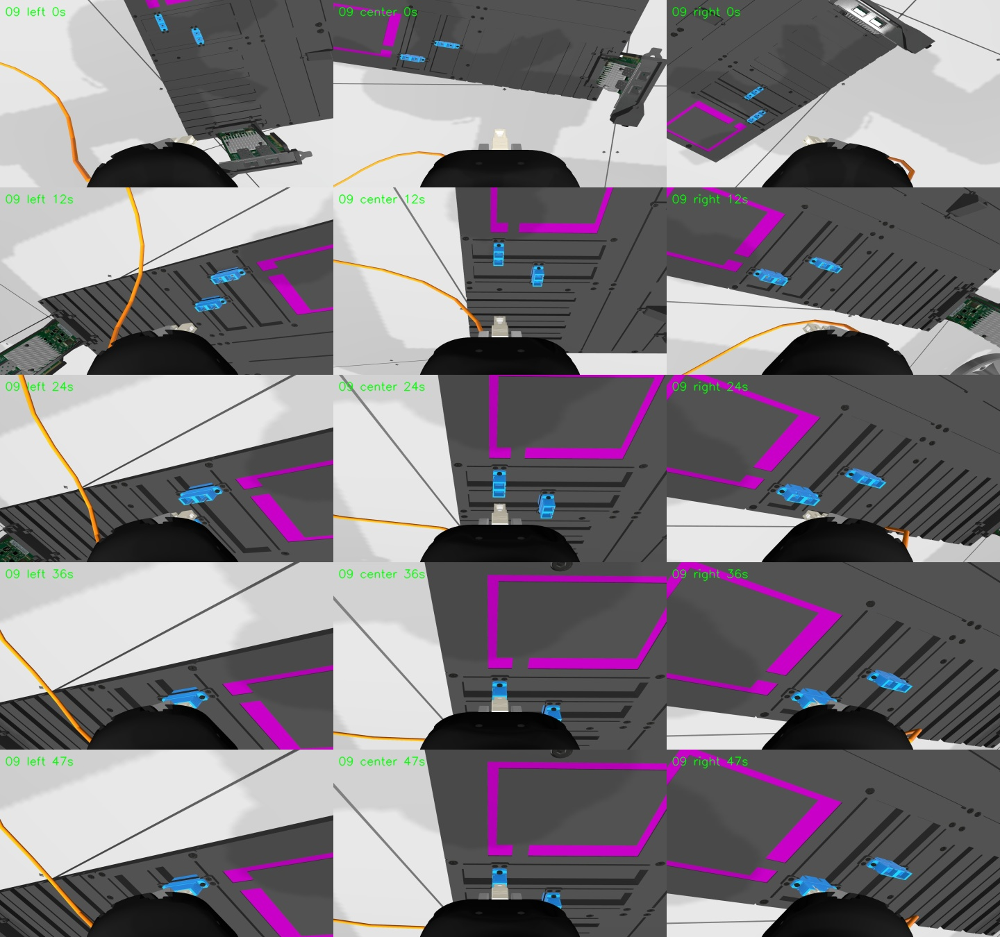
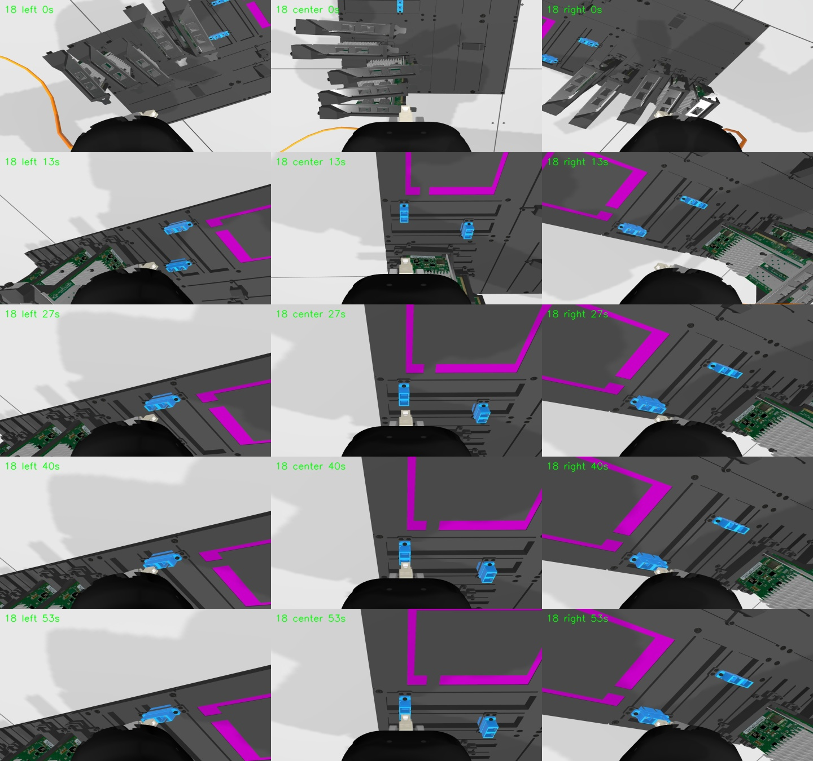
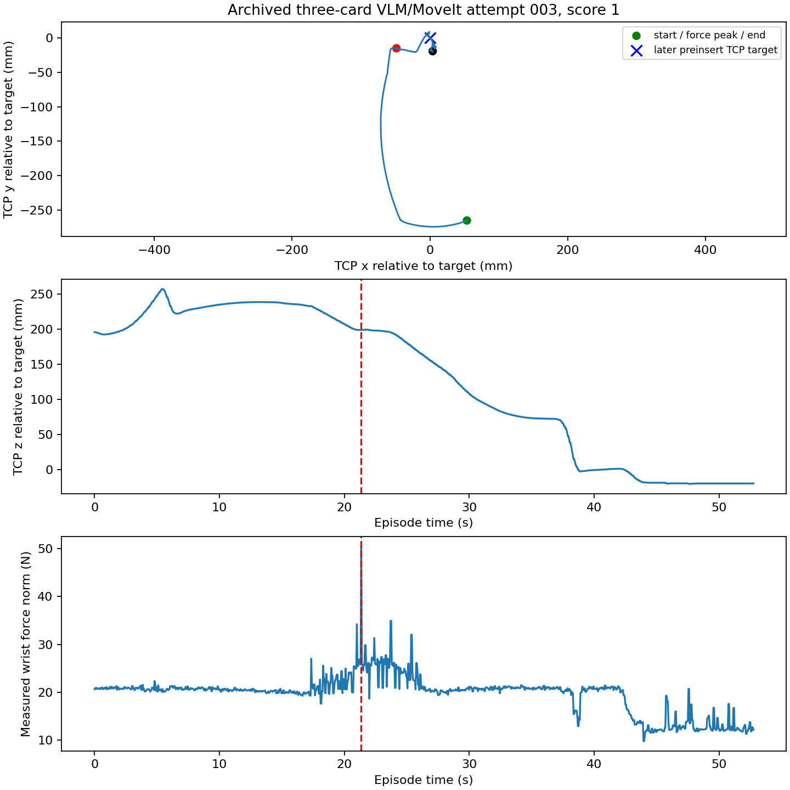

# Ordinary development cable audit

Date: 2026-09-23

## Why this audit was needed

The released three-trial qualification YAML and the current three-trial sample
YAML are different. The current sample SC-to-SC trial has no NIC cards, whereas
the qualification SC trial has three. Our earlier selected stress cases did not
exhaust ordinary development combinations. The user also recalled frequent
Gazebo cable snags with CheatCode in older normal evaluation runs. That memory
is a reason to search the broad development scenes, not a confirmed label for
any particular retained episode.

## Historical archive audit

`outputs/trajectory_datasets/expert_verified/excluded_episodes.json` contains
275 excluded SC-to-SC episodes. The reasons are:

| Reason | Count | What it establishes |
| --- | ---: | --- |
| Officially scored noninsertion | 212 | All came from one-, two-, or three-card collections that intentionally stopped near the gate. They do not test a full insertion attempt. |
| Unresolved score or raw trajectory lineage | 63 | These must not be counted as failed insertions or successful expert episodes. Some selection reports have high aggregate scores, but the raw official score is unavailable. |

Those episodes used planned joint motion followed by CheatCode
(`joint_position_then_cheatcode`). They are not stock CheatCode runs from the
normal three-trial sample YAML. Force and vision can still suggest which scenes
are worth replaying.

The native LeRobot state stores measured wrist force in state indices 26--28.
Across the middle 10--80% of each near-gate episode, the force peak exceeded
30 N in 0/23 one-card, 5/86 two-card, and 12/100 three-card episodes. Examples
with three cards reached 54.5 N (episode 32 at 22.4 s) and 58.5 N (episode 39
at 21.8 s). Their measured TCP speed dipped to 0.015 and 0.013 m/s, then
recovered. The wrist views show the cable close to cards during this motion.
They are **contact candidates**, not sustained cable-snag examples: the
retained data has no body-specific contact trace, and the planned trajectory
continued after the force peak.

One two-card episode reached a much larger recorded force of 344 N at 47.3 s.
Its camera views place the board outside the wrist view and show a taut cable;
they cannot identify whether the force came from a card, a cable length limit,
or another body. It is retained as a separate anomaly, not labeled as a card
snag.

Reproduce the archive summary with:

```bash
.pixi/envs/default/bin/python \
  artifacts/prod_cheatcode_audit/summarize_historical_sc_archive.py \
  artifacts/prod_cheatcode_audit/ordinary_broad_followup/historical_summary.json
```

The machine summary and two reviewed force timelines are in
`artifacts/prod_cheatcode_audit/ordinary_broad_followup/`. Full old videos are
under `outputs/trajectory_datasets/clean_including_no_insert_trajs/`.

## Current stock CheatCode replay

A bounded 19-trial suite runs the installed stock CheatCode in the pinned
post-fix official Gazebo image. It covers SFP-to-NIC with 1--5 cards, SC-to-SC
with 0--5 cards to each SC target rail, and two saved historical randomized SC
scene configurations. Each trial starts from its configured reset with normal
collisions. The two historical scene replays use stock CheatCode from reset;
they do not recreate their original planned joint path.

The suite is a stratified development diagnostic. It samples one layout for
each basic card-count/target combination; it does not estimate a population
failure rate or exhaust board pose, card yaw, grasp, or cable state.

Run and replay artifacts:

```bash
.pixi/envs/default/bin/python \
  artifacts/prod_cheatcode_audit/make_ordinary_broad_suite.py \
  /var/tmp/chmin_aic_ordinary_broad_20260923
bash artifacts/prod_cheatcode_audit/run_ordinary_broad_suite.sh \
  /var/tmp/chmin_aic_ordinary_broad_20260923
```

The rootless container uses GPU 1 and ROS domain 86. The raw scoring MCAPs,
one-second camera frames, logs, and exact generated YAML are in
`/var/tmp/chmin_aic_ordinary_broad_20260923/`. The suite uses the official
image digest `sha256:9aa2ffdbb946d38edde1bac7b5f02a44cfbea26e3b04a9c74e09f14c97472923`.

The official tier-3 score determines insertion outcome. A cable snag label
requires more: show that the cable is held against a card or another obstacle,
the robot keeps commanding progress while measured plug/TCP motion stalls, and
the force or tension rises at the same time. Wrist images alone cannot name a
hidden contact body. The scorer's `contacts` category reports off-limit
contacts; a zero penalty does not rule out cable contact with a card.

## Current replay results

The first long batch developed a Gazebo `physics entity ptr` error while
tearing down trial 8, then logged hundreds of thousands of those errors in
each later trial. Its later noninsertions are **invalid diagnostic evidence**.
We replayed every affected scene in its own new container, including the two
initial retries spoiled by an accidental overlap of audit containers. The
selected score for each of the 19 scenes now comes from a successful model
validation, a scoring bag, and zero physics-entity errors. All selected runs
used the installed stock CheatCode from reset and normal collisions.

| Task and target | Cards | Clean official tier-3 outcomes |
| --- | --- | --- |
| SFP-to-NIC | 1, 2, 3, 4, 5 | full, partial, full, full, full |
| SC-to-SC, rail 0 | 0, 1, 2, 3, 4, 5 | full in all six |
| SC-to-SC, rail 1 | 0, 1, 2, 3, 4, 5 | full, partial, full, partial, partial, full |
| Historical randomized SC layouts | 5 and 3 | no insertion, partial |

**Total: 13 full, five partial, one no insertion, across 19 valid scenes.**
This stratified suite samples one layout per ordinary card-count/rail
combination and two saved layouts. It is not a production success-rate estimate.
The number of cards alone did not determine the outcome: for example, the
five-card rail-1 scene inserted, while the one-, three-, and four-card rail-1
scenes stopped partially inserted.

### What the failed scenes actually show

The following numbers use the measured plug tip relative to the selected port
entrance frame. Positive axial position means the tip crossed that frame; it
is **not** the scorer's remaining insertion distance. TCP command error is the
distance between the commanded and measured TCP positions at the end.

| Scene | Official result | Terminal lateral / axial / orientation | TCP command error | Peak force | Review |
| --- | --- | --- | ---: | ---: | --- |
| SFP, two cards, NIC 1 port 0 | partial, scorer says 40 mm remaining | 0.62 mm / +2.33 mm / 0.19° | 169 mm | 21.2 N | TCP stopped while the target kept advancing; cable passes over the card area, but no body-specific contact evidence. Force fell to roughly 7–8 N during the stall. |
| SC, one card, rail 1 | partial, scorer says 10 mm remaining | 0.38 mm / +10.50 mm / 0.09° | 61 mm | 21.5 N | Near-aligned axial stop; cable clear of card field in recorded views. |
| SC, three cards, rail 1 | partial, scorer says 10 mm remaining | 0.09 mm / +10.49 mm / 0.06° | 61 mm | 21.4 N | Same near-aligned axial stop; force decreased as commanded motion diverged from measured motion. |
| SC, four cards, rail 1 | partial, scorer says 10 mm remaining | 0.18 mm / +10.49 mm / 0.06° | 61 mm | 21.4 N | Same near-aligned axial stop with cable clear in the recorded views. |
| Historical randomized SC, five cards | no insertion, scorer says 20 mm from port | 10.51 mm / +2.17 mm / 0.05° | 73 mm | 26.1 N | Lateral error grew during final approach; cable is not visibly caught on the NIC cards. |
| Historical randomized SC, three cards | partial, scorer says 10 mm remaining | 1.22 mm / +2.18 mm / 0.10° | 70 mm | 23.2 N | Lateral error at contact, then measured motion stopped; cable stays outside the card field. |

The three named rail-1 partials are more useful as **local insertion-blockage**
examples than cable-snag examples. The five-card historical scene is an
approach/alignment problem. Force alone cannot name the colliding body, and
the scoring bags contain no cable-to-card collider topic. The two-card SFP
scene remains a cable-contact *candidate* because of cable/card proximity,
but its falling force and stagnant TCP do not prove cable tension caused the
failure. **No causal cable-to-card snag was established in these 19 runs.**
This does not refute older observations under different randomized layouts,
routes, or simulator revisions.

### Reproduction and retained evidence

The exact generated scene YAML, manifest, historical archive summary, all
19 selected scores, and **every invalid as well as valid attempt** are in
`artifacts/prod_cheatcode_audit/ordinary_broad_followup/`. The machine summary
records the selection rule and per-attempt Gazebo error counts. The one-second
three-camera videos and five-timepoint sheets for scenes 02, 09, 13, 18, and
19 are retained under its `videos/` directory. Their measured plug/port
timelines are the adjacent `trial_*_analysis.json` files. Original MCAPs,
all captured frames, engine logs, and raw scores remain in the following bulk
roots:

```text
/var/tmp/chmin_aic_ordinary_broad_20260923/
/var/tmp/chmin_aic_ordinary_fresh_20260923/
/var/tmp/chmin_aic_ordinary_fresh_tail_20260923/
/var/tmp/chmin_aic_ordinary_fresh_retry_20260923/
/var/tmp/chmin_aic_ordinary_fresh_retry_08_20260923/
```

The isolated replay command was:

```bash
bash artifacts/prod_cheatcode_audit/run_fresh_ordinary_followups.sh \
  /var/tmp/chmin_aic_ordinary_broad_20260923 \
  /var/tmp/chmin_aic_ordinary_fresh_retry_20260923 \
  trial_09_sc_cards1_sc1 trial_10_sc_cards2_sc0
```

The full command set is embodied in `make_ordinary_broad_suite.py`,
`run_ordinary_broad_suite.sh`, `run_fresh_ordinary_followups.sh`,
`analyze_ordinary_broad_trial.py`, and
`summarize_ordinary_followups.py` in `artifacts/prod_cheatcode_audit/`.
The selected score report can be regenerated from the five bulk roots:

```bash
.pixi/envs/default/bin/python \
  artifacts/prod_cheatcode_audit/summarize_ordinary_followups.py \
  /var/tmp/chmin_aic_ordinary_broad_20260923 \
  /var/tmp/chmin_aic_ordinary_fresh_20260923 \
  /var/tmp/chmin_aic_ordinary_fresh_tail_20260923 \
  /var/tmp/chmin_aic_ordinary_fresh_retry_20260923 \
  /var/tmp/chmin_aic_ordinary_fresh_retry_08_20260923 \
  artifacts/prod_cheatcode_audit/ordinary_broad_followup/combined_summary.json
```





## Agent/VLM route follow-up

The user suggested that the remembered snag might have come from the **agent/VLM
transport route**, rather than stock CheatCode. This is consistent with an
older [SC NIC bypass template](../expert_matrix_template_fixes.md#sc-to-sc-nic-bypass-full-insertion-template):
for a one-SC-port, five-NIC-card run seeded `51500`, a previous center-camera
review recorded the cable catching on the NIC stack. The subsequent
outside-left route was accepted with score `89.17`. In this collector the VLM
chose a symbolic approach; MoveIt supplied joint-space transport, then a
ground-truth geometric controller attempted final insertion. The VLM did not
issue low-level actions. The local and checked S3 clean archive retain the
successful run's metadata but **not its original failed trajectory or video**.
The historical note is evidence of a prior observation, not a measurement we
can independently relabel from the missing raw episode.

To find a testable substitute, we scanned **190 retained SC full-insertion
agent replay attempts** with official scores, excluding the collections that
intentionally stopped near the gate. **150 scored at most 1.** A screen for
force above 30 N and less than 3 mm measured TCP travel over a one-second
window in the middle 10--80% of the episode found only one low-score attempt;
its official off-limit contact names a robot wrist collider against the
enclosure wall, not a cable/card pair. This screen does not prove that the
other attempts had no brief cable contact. The exact per-attempt inventory and
criterion are in `vlm_review/low_score_scan.json`.

One saved three-card run (attempt `000003` in
`sc_ports_2/n100__sc_ports2_nic3_n100`) had score **1**, a **50.5 N** peak in
the recorded 20 Hz wrist state, and a camera view with the cable close to the
NIC stack. The saved VLM strategy explicitly called cable risk `medium` and
requested an outside-left path. At its 21.35 s force peak, measured TCP was
about 51 mm laterally and 199 mm vertically from the later preinsert TCP
target. It moved **19.1 mm over 20--22 s**, so that peak was a transient
contact, not a persistent transport stall. The failure came later: the
geometric handoff's tracking gate recorded **13.9 mm lateral error** and did
not insert. The plot below uses the target TCP recorded at the first later
tracking gate for retrospective motion analysis; it is not a deployable
observation.



We replayed that exact saved scene YAML and joint trajectory in a fresh
rootless container with normal collisions, GPU 1, and the pinned current
Gazebo image. The replay again scored **1** with no insertion event and zero
Gazebo physics-entity errors. Its terminal plug was **15.5 mm lateral** and
**51.4 mm before** the port entrance frame; the peak measured force was
33.7 N. The replay's last tracking gate again showed a roughly 15.5 mm
lateral miss. The current local teacher code and Gazebo image differ from the
archived run, so the dynamics and force peak are not expected to match
bitwise. The repeated failure is an **approach/handoff miss**, not a confirmed
cable snag.

Finally, we regenerated the **first** one-port, five-card scene from the
retained seed-`51500` request and ran stock CheatCode as a route control.
It scored **54.50**, a partial insertion with about 10 mm remaining; the
terminal plug was 0.39 mm lateral and 2.18 mm through the entrance frame.
Peak measured force was 27.0 N, with no insertion event. The recorded cable
stayed clear of the NIC stack. This regenerated scene and the direct CheatCode
route do not reconstruct the missing failed VLM route, and current scene
generation may differ from the old run. They show why a stock CheatCode sweep
cannot settle a route-dependent cable-snag question.

The [machine summary](../../artifacts/prod_cheatcode_audit/ordinary_broad_followup/vlm_review/summary.json)
links the original attempt, exact replay manifest, seed request, scores,
metrics, and compact videos. The compressed replay trajectory, scene YAML,
runtime traces, and force-review images are in the same `vlm_review/` folder.
Bulk MCAPs and one-second frames are in
`/var/tmp/chmin_aic_vlm_route_replay_20260923/` and
`/var/tmp/chmin_aic_vlm_seed51500_20260923/`.

The replay can be reproduced by decompressing
`vlm_review/replay_sc3_003/smooth_trajectory.json.gz` beside its
`eval_config.yaml`, then running
`bash artifacts/prod_cheatcode_audit/run_vlm_attempt_replay.sh <that-directory>`.
The seed request was generated with
`generate_trajectory_dataset.py --request-yaml <request> --dry-run
--num-trials-override 1`; the resulting scene was run with
`run_ordinary_broad_suite.sh`.

## Decision

Prioritize reproducible near-port axial stops and lateral approach errors for
the next recovery-data curriculum. The older five-card note makes the
**VLM/MoveIt route** a concrete cable-snag lead; our retained low-score replay
and seed control did not reproduce its cable catch. Keep cable-specific
recovery gated on a retained incident with synchronized cable geometry,
named contact/tension, force, commands, and measured progress. The documented
outside-left bypass remains a useful route prior. Do not relabel current
partial insertions or the invalid long-batch failures as snags.
