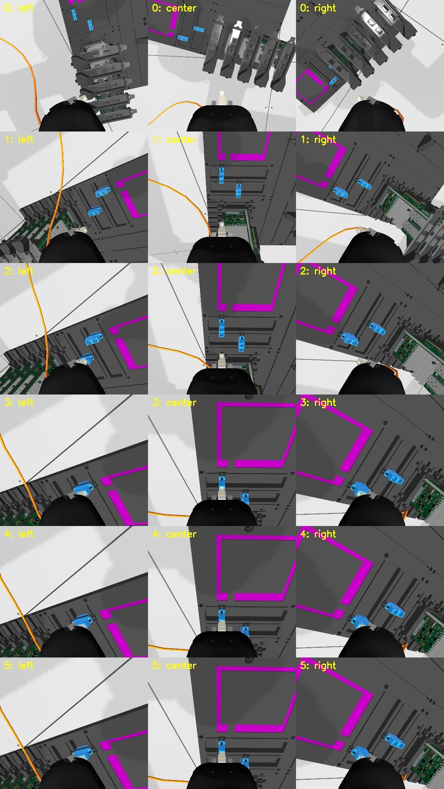
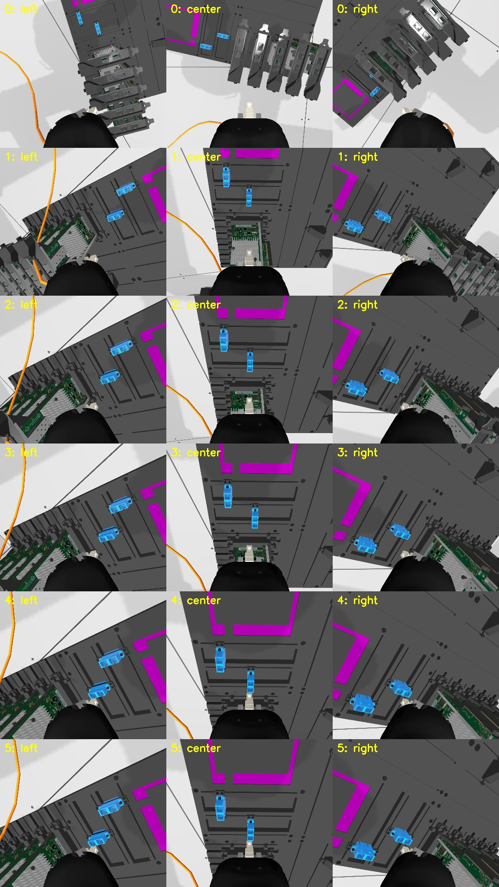

# Ranked insertion failure scenarios and recovery-data plan

Date: 2026-09-23
Status: evidence audit and bounded Gazebo reproduction complete; training plan selected

## Coverage correction: ordinary development evaluation

The bounded audit below did **not** exhaust every ordinary development setting.
The current `aic_engine/config/sample_config.yaml` contains two fixed SFP-to-NIC
trials with one NIC card and one SC-to-SC trial with zero NIC cards. It therefore
cannot reproduce the remembered SC cable interaction among several NIC cards.
The production-family suite added selected 0/1/3/5-card cases, but it was still
a bounded sample rather than the complete `training_broad` randomization matrix.

Historical Gazebo data provides a reason to investigate the cable category,
but its rejection count is not a failure count. The unfiltered archive contains
275 excluded SC-to-SC episodes from randomized one-through-five-card
collections: 212 have official noninsertion scores and belong to collections
deliberately stopped near the gate; 63 lack the raw score or trajectory lineage
needed to verify insertion. Their replay mode was
`joint_position_then_cheatcode`: a planned initial motion followed by the
official CheatCode action, rather than the stock three-trial sample evaluator.
Timeline review shows the cable passing against or between card structures in
some multi-card episodes. In the middle 10--80% of the retained trajectories,
force exceeded 30 N in 0/23 one-card, 5/86 two-card, and 12/100 three-card
episodes. These are force/contact candidates. The saved wrist videos and state
do not identify which body touched the card; the deliberately stopped
trajectory also cannot establish that contact caused noninsertion. A causal
snag label requires a full insertion attempt with synchronized command, measured
motion, cable geometry, force, and contact evidence.

Consequently, "no snag in the recent bounded suite" is a negative result for
that suite only. The [ordinary development audit](2026-09-23-ordinary-development-cable-audit.md)
now has 19 clean stock-CheatCode scenes: 13 full, five partial, one no
insertion, and no causally established cable-to-card snag. Their first long
batch was invalid after Gazebo physics-entity errors; isolated replays supply
the selected scores. A separate archived expert-generator note records a
five-card **VLM/MoveIt route** where the center camera showed the cable catch
on NIC cards, followed by a successful outside-left bypass. The failed raw
route/video is not retained. Cable snag remains an **unresolved,
route-dependent audit target**, not a label for the current stock-CheatCode
failures.

The later [fixed five-card route probe](2026-09-23-fixed-five-card-route-probe.md)
deliberately tested three across-card and three outside-left paths on the
same Gazebo scene. One across-card run failed with a cable segment within
0.9 mm of a main PCB and nearly stationary during the subsequent approach;
its planned-route repeats kept more clearance and inserted fully or partially.
This raises the priority of instrumenting a **route-sensitive cable-trap
candidate**, but the existing scorer still lacks named cable/card contact,
so the accepted causal-label set remains empty.

## How this list was built

This ranking includes a failure only when at least one saved rollout supports
it. Plausible mechanisms that have never been observed are listed as coverage
gaps, not as established failures. The ranking considers:

1. how likely the failure is in released evaluation or closely related scenes;
2. how reliably a useful incident can be reproduced;
3. whether the incident teaches a recovery behavior that transfers to other
   failures.

The released qualification YAML is fixed and cannot expose every development
failure. Evidence therefore comes from three explicitly separated sources:

- exact stock-CheatCode qualification replays in Gazebo;
- production-family Gazebo stress runs using released bounds;
- saved Isaac or Gazebo development rollouts.

Targeted samples are diagnostic evidence, not estimates of production failure
frequency.

## New targeted Gazebo reproduction

Ten additional stock-CheatCode SC-to-SC trials were run in the post-fix
official image. They used three exact Trial 3 repeats, both SC target rails with
five NIC cards, and three repeats of the documented 2 mm / 0.04 rad grasp
offset that previously produced a partial insertion.

| Group | Full | Partial | No insertion | Main observation |
| --- | ---: | ---: | ---: | --- |
| Exact released Trial 3 | 3/3 | 0/3 | 0/3 | Stable control group |
| Five cards, target SC rail 1 | 0/2 | 2/2 | 0/2 | Near-aligned axial stop about 10.5 mm inside the entrance frame; no insertion event |
| Five cards, target SC rail 0 | 0/2 | 0/2 | 2/2 | Large approach/tracking failure; terminal TCP command error 89 and 126 mm |
| Five cards, bounded grasp offset | 3/3 | 0/3 | 0/3 | Earlier partial was intermittent, not deterministic |

The two rail-1 partials ended with only 0.27 and 0.42 mm lateral error and
0.07--0.08 degrees orientation error. Their peak measured force was almost the
same as the successful controls. The visible cable stayed away from the NIC
card field. These are **card-count-associated axial partial insertions**, but
the evidence does not establish cable contact as the cause.

The rail-0 failures had brief scorer force peaks of 32--47 N, large TCP
tracking error, and no insertion. The cable again remained visibly clear of
the cards. The recorded topics cannot distinguish a rigid collision from a
workspace/controller tracking limit, so the category remains **large approach
blockage**, with the exact collider unresolved.

No valid cable snag was found. This is a useful negative result: five cards can
make the outcome worse without proving that the cable wrapped around a card.





## Ranked scenarios

### Priority 1A: lateral or orientation drift before contact

- **Likelihood:** high for the learned policy.
- **Reproducibility:** high in the current Isaac near-port environment; easy to
  induce in Gazebo with bounded start perturbations.
- **Evidence:** most failures in the eight-episode BC/RL video comparison moved
  beside the opening or away from a nearly aligned reset. Several had 5--18 mm
  lateral error. No cable blocked the opening.
- **Needed behavior:** use the pose estimate to choose a centered approach and
  stop axial motion while lateral or orientation error is outside the gate.
- **Training use:** supervised alignment and short-horizon RL. Backtracking is
  unnecessary until contact or measured stall occurs.

### Priority 1B: local port-lip or axial insertion blockage

- **Likelihood:** medium to high for SC, and higher after small grasp or cable
  state changes.
- **Reproducibility:** high in Gazebo and demonstrated in the zero-card Isaac
  mechanics scene.
- **Evidence:** one of five exact SC replays was partial; a separate bounded
  grasp trial was partial; both new five-card rail-1 trials were partial. A
  saved Isaac rollout stopped 2.60 mm from its target, while a 14 mm retreat
  and 4 mm directional retry reached the gate.
- **Needed behavior:** detect commanded-forward motion with little measured
  progress, retreat enough to unload the contact, correct laterally or
  rotationally, and reapproach slowly.
- **Training use:** this is the first recovery curriculum because it is common,
  reproducible, and directly relevant to insertion.

### Priority 2: large approach blockage by geometry, contact, or workspace

- **Likelihood:** medium in broader layouts; lower in the three fixed released
  qualification trials.
- **Reproducibility:** medium in Gazebo. Isaac can reproduce a gripper-to-card
  hit, but its current SC grasp/scene contract is mismatched and that rollout
  is not valid production data.
- **Evidence:** the released Trial-1 board-pose cross-combination stopped with
  72.6 mm TCP tracking error. The two new five-card rail-0 trials stopped with
  89 and 126 mm error. The current topics do not name the blocking collider.
- **Needed behavior:** stop pushing, backtrack much farther than a local
  insertion retry, then choose a route around the obstacle.
- **Training use:** create this curriculum only after the Isaac SC collision
  contract is faithful. A small port-lip retreat will not teach obstacle
  routing.

### Priority 3: cable-to-card snag or persistent cable tension

- **Likelihood:** unresolved for learned or VLM/MoveIt routes through crowded
  SC scenes. The 19-scene stock-CheatCode sample did not establish one and
  cannot estimate its rate under another route.
- **Reproducibility:** the older [SC NIC bypass note](../expert_matrix_template_fixes.md#sc-to-sc-nic-bypass-full-insertion-template)
  reports a five-card center-camera cable catch and a successful route change,
  but the failed raw trajectory/video is missing from the checked local and
  S3 clean archives. A saved three-card VLM/MoveIt score-1 trajectory was
  replayed exactly in the current Gazebo image and again scored 1; both runs
  failed laterally at port handoff, with no persistent transport stall. A
  regenerated five-card seed-51500 stock-CheatCode control ended partially
  inserted with its cable visually clear of the cards. These do not reproduce
  the historical snag.
- **New deliberate route test:** in one fixed five-card scene, across-card
  transport produced one full, one partial, and one no insertion across three
  runs. Outside-left produced one full and two partial insertions. The
  no-insertion across run had a 0.9 mm cable-center/main-PCB gap and a nearly
  stationary cable link during its late TCP stall. Repeats of that nominal
  route had at least 8.6 mm cable-center clearance. This is a fresh candidate,
  not a named contact or causal cable-snag label. A lower pass failed much
  earlier with the cable far from cards and is a robot-clearance confound.
- **Accepted causal evidence for a trainable incident:** none retained yet. The earlier Isaac “snag” remained after cable
  collisions were disabled and was traced to roughly 128 N of gripper-housing
  contact with a card. The new stock Gazebo videos also show the cable clear
  of the card field. The historical observer's note warrants targeted replay,
  but cannot supply force, exact route, and named contact labels itself.
- **What other data can teach:** Priority 1B and 2 data can teach force/stall
  detection, unloading, and measured-path backtracking. It cannot by itself
  teach which motion unwinds a cable or routes slack around a card.
- **Coverage gap:** if a faithful simulator still cannot create this incident,
  retain generic force-safe recovery but report cable-specific recovery as
  unvalidated. This failure is more concerning for varied or physical scenes
  than for the released fixed qualification YAML.

### Priority 4: reset, stale-command, or spawn transient

- **Likelihood:** low in the current post-fix image, historically observed by
  participants.
- **Reproducibility:** possible as an infrastructure fault.
- **Training decision:** do not teach the actor to compensate. Detect an invalid
  reset, reject the episode, clear commands, and reset again.

No separate priority is assigned to imagined self-entanglement, free-end
snagging, or named gripper-card collision in production because no valid
current rollout establishes them. They enter the ranked list only after a
saved incident provides geometry, motion, force, and visual evidence.

## What transfers across failure classes

```text
force or measured stall
          |
          v
stop forward commands
          |
          v
backtrack along measured path
          |
          +-----------------------+
          |                       |
   local port contact       large obstacle/tension
          |                       |
  small lateral/angle       larger retreat and route
  correction, retry         selection with memory
```

The left branch is well supported by current data. The right branch needs its
own incidents. Cable snag would share the stop-and-unload prefix, but its route
selection needs cable-specific temporal or visual evidence.

## Ordered next steps

1. **Freeze the new evidence.** Keep exact manifests, official scores, compact
   plug/port analyses, videos, and contact sheets. Outcome labels come from the
   official tier-3 scorer because later bags can replay transient-local event
   history.
2. **Repair the Isaac SC contract.** Match the Gazebo grasp, endpoint, port
   frame, cable collision exceptions, and measured terminal pose with all
   ordinary collisions enabled. Require stable zero-, three-, and five-card
   resets before using Isaac SC data for RL.
3. **Collect Priority 1 incidents first.** Sample bounded lateral, axial, and
   angular offsets around both SFP and SC openings. Retain failures, failed
   recoveries, and successful retreat/realign/reinsert episodes. Use simulator
   geometry only for labels and reward, never as actor input.
4. **Train the local recovery policy.** Warm-start the actor from successful
   BC and recovery actions. Train the critic offline on successes and failures,
   then compare correlated exploration against hardcoded measured-path
   backtracking followed by near-lateral correlated exploration.
5. **Add Priority 2 only after the scene gate.** Generate larger approach
   blocks with normal collisions and train a separate long-retreat/route option.
   The option selector may use image history, robot state, force, measured
   motion, and the predicted pose.
6. **Instrument the route-sensitive cable candidate.** The fixed-scene
   across-card versus outside-left comparison is now retained. Try to recover
   the missing historical VLM/MoveIt failure if another backup exists, and
   add named cable/card contact or cable-tension measurements to the fresh
   Gazebo run. Verify the stall with a paired mechanics ablation before using
   it as a training label. Port the incident to Isaac only after its five-card
   grasp/collision contract is faithful. Do not infer contact identity from
   force alone.
7. **Close Isaac-to-Gazebo transfer.** First replay successful Isaac recovery
   behavior as supervised Gazebo fine-tuning data. Then use short incident
   resets for offline critic warm-up and a small amount of online Gazebo RL.
   Gazebo's low throughput makes full-episode online learning the last step.
8. **Evaluate by task and failure class.** Report SFP-to-NIC and SC-to-SC,
   0/1/3/5 cards, both SC rails, approach/alignment/contact phases, insertion,
   peak and integrated force, recovery attempts, and latency. Keep the sealed
   final configurations closed until development gates pass.

World-model and Seer work remains parked. The next work is perception plus
phase-aware BC/RLPD-style RL with explicit recovery modes.

## Artifacts

- Compact summary: `artifacts/prod_cheatcode_audit/targeted_failure_reproduction/summary.json`
- Exact trial manifest and YAML: `artifacts/prod_cheatcode_audit/targeted_failure_reproduction/`
- Bulk bags, one-Hz frames, analyses, and videos:
  `/var/tmp/chmin_aic_targeted_failure_20260923/`
- Compact videos: `artifacts/prod_cheatcode_audit/targeted_failure_reproduction/videos/`
- Prior exact audit: [official CheatCode failure audit](2026-09-23-official-cheatcode-failure-audit.md)
- Ordinary and VLM-route follow-up: [19-scene audit and exact archived-route replay](2026-09-23-ordinary-development-cable-audit.md), compact records under `artifacts/prod_cheatcode_audit/ordinary_broad_followup/`
- Isaac mechanics evidence: [SC mechanics and routing](2026-09-23-sc-mechanics-and-routing.md)
- Learned-policy videos: [SERL video failure analysis](2026-09-23-serl-video-failure-analysis.md)
