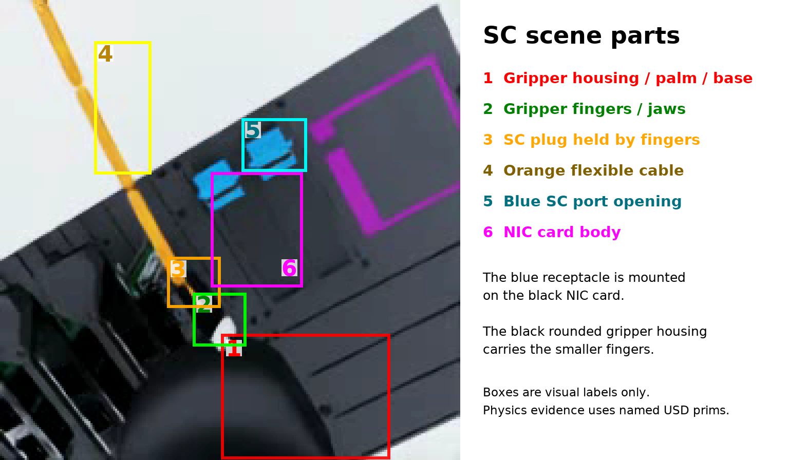

# SC-to-SC Isaac mechanics and routing bring-up

Date: 2026-09-23  
Status: mechanics partly validated; multi-card result is diagnostic proxy evidence

> **Scope correction:** these are Isaac development-scene mechanics probes, not
> runs of the released Gazebo production evaluation. Do not use the failure
> categories or rates below as production evidence. The separate
> [official CheatCode audit](2026-09-23-official-cheatcode-failure-audit.md)
> runs the stock policy against the exact released qualification YAML and keeps
> production observations separate from simulator bring-up hypotheses.

## Why this experiment was required

The approved SC continuation begins by proving that Isaac has the correct plug,
port, grasp, insertion depth, card geometry, cable topology, and terminal
accounting. Training BC or RL before that check would teach a policy to work
around simulator setup errors.

No BC, critic, or actor was trained in this bring-up. Every motion below is a
privileged joint-space mechanics probe. True simulator geometry and IK targets
are not deployable actor inputs.

## Corrections made before interpreting a rollout

Several earlier SC probes were invalid for different reasons.

1. The SC ports were mounted 5 mm above the board. The source task-board xacro
   mounts them at 16.5 mm; the old value embedded the receptacle in the board.
2. The prepared cable had LC at the gripper and SC at the free end. The source
   reversed SC task has SC at rope endpoint 0 and LC at endpoint 20. The new USD
   builder rewires those fixed joints and verifies their residual transforms.
3. A builder early return ignored requested collision disables. This made old
   “no collision” conclusions unreliable. The builder now applies and reports
   every requested disable.
4. Teleporting the arm while leaving the cable behind caused a large first-step
   snap. Near-gate reset can now use actuator-driven interpolation and records
   the solved and realized joint states.
5. The old target was the center of Gazebo's solid SC touch-sensor box. A plug
   cannot physically move its tip to the center of that collider. The current
   empirical stable-contact target is port-local `(0, 0, -4.65 mm)`, or 8.99 mm
   from the nominal entrance. A recorded Gazebo terminal pose should refine
   this value later.
6. The reachable Isaac grasp put the gripper housing into the board. A 30 mm
   connector extension provides board clearance while preserving exact fixed
   joint transforms. This remains an Isaac mechanics approximation.

## Zero-card physical insertion and local recovery

With all normal collisions active, a direct approach stopped 2.60 mm from the
contact target. A 14 mm retreat followed by a 4 mm lateral retry in one
direction reached 0.084 mm, ended at 0.099 mm lateral and 0.008 mm axial error,
and remained inside the component gate for 53 rows. The opposite lateral retry
briefly reached 0.505 mm but later diverged.

This is useful evidence for the proposed recovery structure:

```text
blocked approach
      |
      v
retreat far enough to unload contact
      |
      v
try a coherent lateral direction
      |
      v
reapproach and hold contact
```

It also shows why the direction cannot be arbitrary. The positive 4 mm retry
succeeded; the matched negative retry did not remain successful.

## The first five-card “snag” was actually gripper-card collision



In this image, the **gripper housing** (1) is the large rounded black rigid
body, also named the gripper palm or base. The **fingers** (2) are the smaller
jaws mounted on it. They hold the **SC plug** (3), which is attached to the
orange flexible cable (4). The blue receptacle is the **SC port opening** (5),
mounted on a black **NIC card** (6). The boxes were checked against the
untouched simulator frame. They are visual aids; the causal collision result
comes from named USD collision prims and contact-sensor logs.

The normal full-start five-card probe stopped about 13.2 mm away with about
12.5 mm lateral error and a 165.8 N peak wrist load. The left-camera video made
the cable look suspicious, but a collision ablation gave the causal answer:

- disabling rope, plug, LC, and SFP collisions did **not** change the failure;
- a contact sensor on `gripper_hande_base_link` measured about 128 N against a
  NIC card;
- disabling only the gripper-base colliders reduced the best miss to 2.14 mm;
- disabling all ten gripper colliders exposed a different, smaller interaction.

Therefore the original five-card failure is not valid cable-snag data. The
reachable vertical grasp makes the physical gripper cross a horizontal NIC
card. The source reversed Gazebo grasp rotates the gripper differently, but it
is not physically reachable in the current Isaac board/base arrangement: the
arm hits its scene or limit envelope before attaining that pose. Roll-offset
grasp probes at plus and minus 90 degrees also failed to provide a stable,
reachable full insertion.

The [invalid original-grasp video](../../outputs/experiments/2026-09-23_sc_cable_bringup/videos/invalid_original_grasp_nic5_left.mp4)
is retained so this failure is not later mistaken for learned cable behavior.

### What “disabling a collision” means in these diagnostics

Isaac keeps separate visual geometry and collision geometry. Setting a USD
collision prim's `physics:collisionEnabled` attribute to `false` leaves the
part visible and moving, but PhysX no longer lets that collision shape push on
or be pushed by other collision shapes. It is therefore a causal ablation,
not a proposed robot configuration.

The cable/plug ablation disabled the collision shapes for the rope links and
connector bodies while leaving the rendered cable, robot motion, cards, board,
and port visible. Since the same failure remained, cable contact was not the
main cause of that rollout. The gripper-base contact sensor then measured about
128 N against a NIC card. A separate diagnostic asset disabled gripper
collision shapes; that let the visually unchanged gripper pass through cards.
The latter asset was used only to ask whether a routed cable path could work if
the known gripper-clearance defect were removed.

The builder implements these diagnostic switches with
`--disable-collision-substring`; the probe scripts can also disable matching
runtime prims with `--disable_collision_prim_regex`. Every matched path must be
logged. A collision-disabled rollout is invalid as autonomous performance or
training data unless that disabled contact exactly reproduces the source
simulator's intended physics contract.

## Bounded cable-routing proxy

For a diagnostic only, all gripper collision shapes were disabled while the SC
plug, rope, remaining connector, cards, board, and port collisions stayed
active. This approximates the clearance that the source grasp should provide;
it is not a deployable scene fix.

Three seeds compared the same scripted path with and without a large route
around the card edge. The gate is evaluated by components: lateral at most
0.5 mm, axial at most 1 mm, and orientation at most 2 degrees.

| Method | Stable final gates | Final lateral, mm | Final axial, mm | Peak wrist force, N |
| --- | ---: | --- | --- | --- |
| Direct high approach, seeds 1--3 | 1/3 | 3.215 / 0.095 / 7.783 | 4.394 / 0.635 / 3.213 | 62.4 / 179.6 / 65.3 |
| High approach, +100 mm side route, lower on the outside, then return, seeds 1--3 | 3/3 | 0.147 / 0.112 / 0.101 | 0.485 / 0.385 / 0.459 | 42.0 / 30.6 / 42.2 |

The route is temporally coherent: rise above the cards, move 100 mm around the
safe side, lower outside the card footprint, and then return toward the port.
This supports a hierarchical transport/recovery option. It does not establish
an autonomous policy result because its waypoints came from simulator IK.

Camera rendering changes the PhysX outcome enough to matter. The recorded
seed-1 route entered the component gate briefly at step 489, then ended at
1.89 mm lateral error. The metrics-only seed-1 run remained in the gate for 52
rows. Preserve the [recorded route video](../../outputs/experiments/2026-09-23_sc_cable_bringup/videos/proxy_x100_route_seed1_left.mp4)
as a separate rollout rather than overwriting the matched metrics result.

## Decision

The following claims are supported:

- zero-card SC insertion mechanics can work in the corrected scene;
- retreat plus directional lateral retry can resolve a local contact;
- the original multi-card failure was caused primarily by the grasp/scene
  contract;
- in a declared gripper-clearance proxy, a large routed transport is much more
  reliable than a direct approach.

The following claims are not supported:

- the faithful Isaac scene reproduces natural cable snagging;
- the proxy route is an autonomous or learned solution;
- existing SC perception, BC, or RL is ready for this scene.

Do not collect SC BC/RL data until the faithful grasp/scene contract is fixed.
The best next engineering task is to reproduce the source reversed grasp with a
reachable robot/base/board arrangement or an equivalent collision-faithful
gripper model. After that, rerun card counts 0--5 and require stable physical
insertions before beginning the bounded discovery set.

### Source collision-contract follow-up

A post-commit audit found one more source mismatch. The official
`sfp_sc_cable_reversed/model.sdf` deliberately removes the endpoint-0 and
connection-0 colliders because they intersect the gripper palm. It also replaces
the first rope link's 48 mm collider with a 36 mm collider shifted 6 mm away
from the palm. The Isaac builder now reproduces those exceptions by default for
`reversed_topology`. These are part of the source physics contract, not an
experiment-specific collision relaxation.

This source rule is much narrower than “turn off the cable.” The visible plug
and cable are unchanged, and almost all cable collision remains active. Only
the collision volumes immediately inside or beside the palm are removed or
trimmed. Without that exception, the welded plug/cable and the gripper start
with collision volumes occupying the same space. A physics engine then tries
to separate bodies that a fixed joint simultaneously forces together, which
can create large artificial contact forces.

The corrected fixed-joint transform residuals remained below 0.4 nanometers.
The IK solution also required wrapping wrist joint 3 from 4.944 rad to the
equivalent -1.340 rad solution. Even with both fixes, a 40-step full-scene hold
was unstable: peak wrist force reached 36.98 kN and the connector moved far from
the requested pose. Removing board and port collision greatly reduced the
instability; disabling self collision reduced it further. With board, port, and
self collision disabled and a 600-step physical interpolation plus 300-step
hold, force stayed below 0.58 N, but the realized tip still stopped 44.27 mm
from the requested reset pose. This points to a remaining grasp-transform,
scene-placement, or articulation-actuation mismatch in addition to the now
fixed cable-collider mismatch.

The same corrected reversed asset was then held for 40 steps at its native
initial robot posture, without moving it near the board. Its target-distance
diagnostic varied by less than 0.5 mm, so the topology is not intrinsically
exploding at spawn. The remaining failure is introduced by the near-port
placement/reset. A source-plugin audit also found that Gazebo welds the cable
to `ati/tool_link`, whereas the prepared USD weld targets the right gripper
finger. The next audit must reproduce that weld frame exactly and reconcile the
Isaac board/port placement with the source task before another physical probe.

In plain terms, the corrected cable is stable when left where the asset starts.
When the reset asks the robot to hold the same cable near the port, the
requested configuration is not physically realized: forces become extreme or
the tip settles tens of millimeters from the requested pose. That does not show
that the cable correction is wrong. It localizes the remaining defect to the
near-port setup: the gripper-to-plug weld frame, board/port placement, arm reach
and joint representation, reset interpolation, or a combination of these. The
evidence does not yet identify one of those as the sole cause.

An attempted one-step camera capture triggered an Isaac PhysX illegal-memory
error and produced no valid visual artifact. It is retained only in the bulk
log as a simulator failure. The collision-faithful grasp gate therefore remains
failed; no SC learning stage was opened.

## Artifacts

- [Machine summary](../../outputs/experiments/2026-09-23_sc_cable_bringup/summary.json)
- [Artifact map](../../outputs/experiments/2026-09-23_sc_cable_bringup/artifact_map.json)
- [Checksums](../../outputs/experiments/2026-09-23_sc_cable_bringup/sha256.txt)
- Bulk diagnostics: `/var/tmp/chmin_aic_20260920_isaac_world_rl/sc_snag_20260923/`

## Reproduction entry points

All simulator work used the rootless container
`aic_isaac_world_policy_20260920`. The generated USD files are intentionally
ignored because they are derived from the distributed asset. Rebuild the
collision-faithful 30 mm clearance asset inside the container with:

```bash
cd /workspace/isaaclab/aic
ASSETS=aic_utils/aic_isaac/aic_isaaclab/source/aic_task/aic_task/tasks/manager_based/aic_task/Intrinsic_assets
/workspace/isaaclab/_isaac_sim/python.sh \
  aic_utils/aic_isaac/aic_isaaclab/scripts/build_sc_reversed_robot_usd.py \
  --headless --mode reversed_topology \
  --source "$ASSETS/aic_unified_robot_cable_sdf.usd" \
  --output "$ASSETS/aic_unified_robot_cable_reversed_clearance30.generated.usd" \
  --sc-grasp-extension-m 0.03 --print-topology-transforms
```

The diagnostic gripper-clearance asset adds these options to the same command:

```text
--deinstance-substring /World/aic_unified_robot
--disable-collision-substring gripper_hande
```

Run mechanics probes through
`aic_utils/aic_isaac/aic_isaaclab/scripts/serl/probe_target_reward.py` with
`AIC_ISAAC_ROBOT_USD_PATH` set to the generated asset and
`AIC_ISAAC_ARM_ACTION_MODE=joint_position`. The exact per-run JSON paths and
metrics are retained in `summary.json`; the corresponding stdout logs remain
beside them under the bulk diagnostics directory. The generated episode YAMLs
and requests are under that directory's `generated/` and `requests/` folders.
