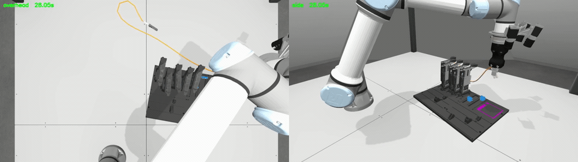
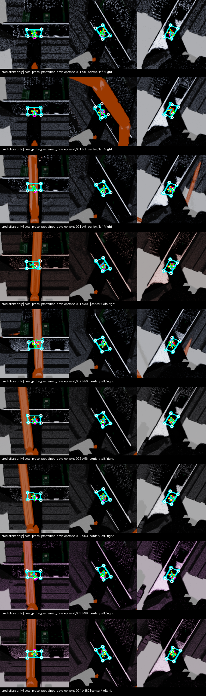
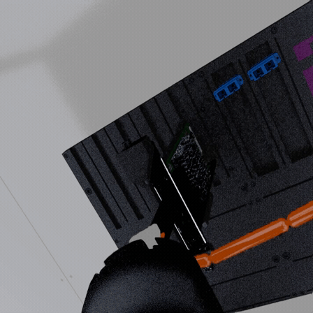
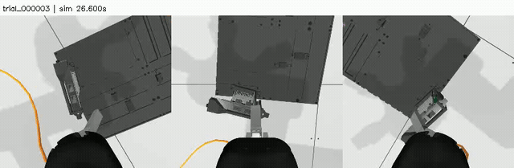
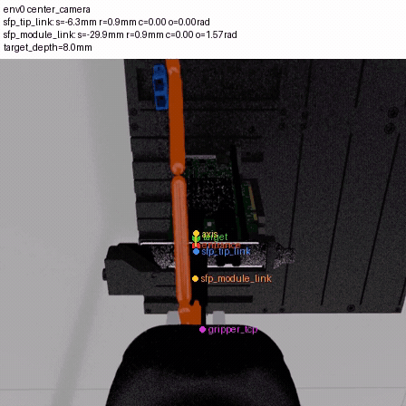

# Robotic cable insertion: planning, perception, and contact recovery

This project tackles simulated insertion of a flexible cable connector into a small port while the robot works around nearby circuit cards. It combines high-level visual planning, collision-checked motion, camera-based pose estimation, imitation learning, and contact-aware reinforcement learning. The experiments below use two different evaluation scopes: **full insertion from a transport start in Gazebo** and **local insertion from near the port in Isaac Lab**.

## 1. Generate demonstrations around obstacles

An early expert pipeline used a vision-language model to choose an approach strategy, MoveIt 2 for arm motion, trajectory smoothing for replay, and a privileged geometric controller for precise final alignment. Gazebo replay exposed a limitation of rigid-arm planning: the trailing flexible cable can interact with cards even when the arm has a valid path. I developed a low lateral bypass that descends behind the card row, travels beside it, tilts the plug in a clear area, and returns aligned to the selected port. Only scored full insertions are admitted as successful demonstrations. The latest collection produced **104 full insertions in 200 varied scenes (52%)**, spanning one to five intervening cards and two destination ports. This is a **privileged teacher** result; an autonomous learned SC policy has not achieved that rate. [Collection record](experiments/2026-09-30-sc-llb-collection.md)

The timing of the wrist tilt matters because the robot rotates about its tool frame, which is offset from the plug tip. In a scored replay, the tool frame moved **1.59 mm** during tilt while the plug tip swept **8.78 mm**. Moving the tilt into a clear part of the route produced a successful full-insertion demonstration. The older-route example below stalls at the **port opening**; the evidence does not establish a card collision. [Tilt and contact analysis](experiments/2026-09-30-sc-tilt-before-return.md)

*Successful privileged teacher route. [Older-route port blockage](images/cable_insertion/older_route_port_blockage.gif) provides a visual comparison; the two short runs do not isolate tilt timing as the sole cause.*

## 2. Predict the plug and port from wrist cameras

A three-camera model predicts the plug point and four port-opening corners, then triangulates a relative 3D pose and correction direction. Training uses simulator geometry as labels; the review image below draws **predictions only**. Cyan marks the opening polygon, magenta the plug, yellow the opening center, and green the correction arrow. On 173 near-port decisions from six held-out episodes, lateral pose error was **0.278 mm median / 0.670 mm p95**, with **94.1%** correction-direction accuracy. The remaining tail motivated later temporal fusion work. [Perception experiment](experiments/2026-09-20-perception-supervised-rl.md)

## 3. Compare visual policies, then predict connector trajectories

I trained ACT, diffusion, and a Dreamer-style world-model policy, then tested a PoseInsert-inspired controller that predicts **four future connector poses relative to the port**. A calibrated transform turns those waypoints into robot commands. Correcting the training/deployment pose frame, preserving all four recorded teacher commands, and adding safe teacher queries from failed rollouts were decisive. On the same six local starts, deterministic trajectory regression seated **6/6** connectors versus **2/6** for the repaired diffusion policy. The selected controller later seated **18/19** across development checks. These are autonomous **8 mm near-port seating** results in Isaac Lab, with no runtime guide or backtracking; they are not full-start cable-routing successes. [Trajectory-policy experiment](experiments/2026-09-22-rpdp-dppo.md)

The world-model branch supplied a useful diagnostic: its supervised visual policy achieved **one full insertion in four development scenes** and reached a 25 mm opening envelope in **17/20** frozen scenes, versus **12/20** for ACT. Neither model fully inserted in the frozen 20-scene test. The preview is a **10× time-lapse of a one-frame-per-second recording** from the successful development scene, not a high-rate control video. [World-model comparison](experiments/2026-09-18-world-followup.md)

## 4. Detect blockage and retry with measured motion

For contact recovery, I built a four-mode probabilistic trajectory actor with SAC-style updates and twin critics. Earlier reward audits gated forward progress on lateral alignment, orientation, and plug-body consistency to reject false insertion signals. A supervisor detects commanded motion that stalls under force, retraces **measured** robot positions, and changes the next approach. Its actions are marked as supervisor-owned in replay so they do not become actor imitation targets. A recording-enabled eight-start local comparison seated **3/8** with recovery enabled versus **1/8** with the same RL actor and recovery disabled. The video lacks per-step recovery-state events, so this comparison does **not** prove that a triggered retreat caused those extra successes. A larger paired test with explicit trigger, measured retreat, and force traces is the next evaluation. [Recovery experiment and review](experiments/2026-09-22-serl-mixture-recovery.md) · [Reward audit](../obsolete/docs/agent_reward_funnel_results_20260523.md)

**Current boundary:** the obstacle-routing teacher, camera pose estimator, local insertion policy, world-model pilot, and recovery controller are separate measured components. Full-start autonomous insertion across varied cable routes remains the integration target.
